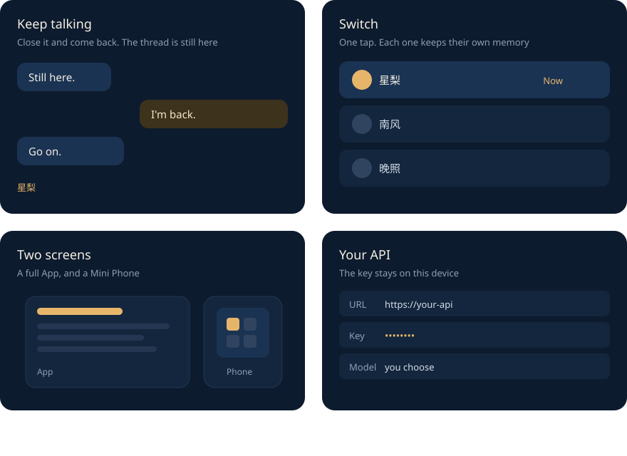

<p align="center">
  
</p>

<h1 align="center">Yueqi</h1>

<p align="center">Long-term company. Switch between characters anytime.</p>

<p align="center">
  <a href="./README.md">简体中文</a> ·
  <a href="./README.en.md">English</a>
</p>

<p align="center">
  <a href="https://github.com/azhimiao/Nyra-yueqi/stargazers"></a>
</p>

Yueqi is for staying with someone over time. Keep several characters, and switch with one tap. Each one keeps their own chat and memory. Data stays on your device. Bring your own OpenAI-compatible API. No cloud account, and no paid credits.

If it fits, leave a [Star](https://github.com/azhimiao/Nyra-yueqi).

<p align="center">
  
</p>

The desktop pet is only a look. Changing it does not change who the character is. Diary, world book, listening, reading, the album, and the calendar sit alongside the chat. Scenario theater keeps its own cast.

### Run

Requires **Node 20+**.

```bash
git clone https://github.com/azhimiao/Nyra-yueqi.git
cd Nyra-yueqi
cp .env.example .env
npm install
npm start
```

Open http://127.0.0.1:5173. After you pick a language and App or Mini Phone, open **API** and fill in your own address, key, and model.

> [!TIP]
> Keep keys in local `.env` or Settings. Never commit them.

### Install

The website package is the commercial build, with login, hosted models, and Credits:

https://download.memprism.com/nyra-latest.apk

https://github.com/azhimiao/Nyra-yueqi/releases/latest

This repository is for running and changing the source yourself. Debug build:

```bash
npm run build:android
```

Output: `android/app/build/outputs/apk/debug/app-debug.apk` (`app.yueqi.open`).

### The edge of this source

Cloud login, hosted models, and BillingCredit are in the website package. Memory palace and turn orchestration are not in this tree. Chat carries the character card and recent messages. See [OPEN_SOURCE.md](./OPEN_SOURCE.md).

### Docs

| Need | File |
|---|---|
| How to contribute | [CONTRIBUTING.md](./CONTRIBUTING.md) |
| Vulnerability reports | [SECURITY.md](./SECURITY.md) |
| Community rules | [CODE_OF_CONDUCT.md](./CODE_OF_CONDUCT.md) |
| Terms / privacy | https://azhimiao.github.io/legal/ |

### Community

Read the [contributing guide](./CONTRIBUTING.md) first. Open an Issue before large changes.

| Channel | Value |
|---|---|
| GitHub | https://github.com/azhimiao/Nyra-yueqi |
| QQ group | 1034044082 |
| Discord | CogPrism |
| WeChat | azhimiaoo |
| QQ | 3804762525 |
| Email | 3804762525@qq.com |

### Building on Yueqi

If your project name includes Yueqi / 月栖 / Nyra, add a README note: **not an official Yueqi project, not affiliated with this repository.**

---

If it is useful, leave another [Star](https://github.com/azhimiao/Nyra-yueqi).

[MIT](./LICENSE) · [Terms and privacy](https://azhimiao.github.io/legal/)
