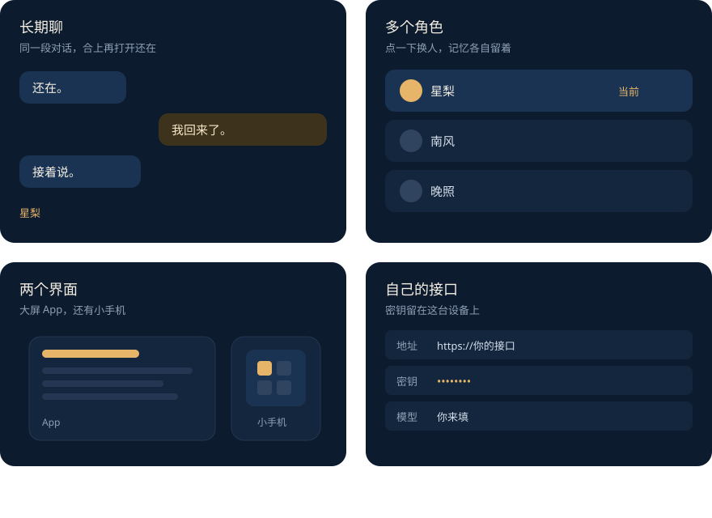

<p align="center">
  
</p>

<h1 align="center">月栖</h1>

<p align="center">长期陪伴。多个角色，随时切换。</p>

<p align="center">
  <a href="./README.md">简体中文</a> ·
  <a href="./README.en.md">English</a>
</p>

<p align="center">
  <a href="https://github.com/azhimiao/Nyra-yueqi/stargazers"></a>
</p>

月栖用来长期陪着你。可以同时留着很多个角色，点一下就换到另一个人，聊天和记忆各自保存。数据在你自己的设备上。模型接口自己带，OpenAI 兼容就行。没有云账号，也没有付费积分。

用着觉得对，就给这个仓库点个 [Star](https://github.com/azhimiao/Nyra-yueqi)。

<p align="center">
  
</p>

桌宠只管样子，换外观不换角色。日记、世界书、一起听、一起看、相册、日历都在旁边。情景剧的人物和关系不接到日常陪伴上。

### 运行

需要 **Node 20+**。

```bash
git clone https://github.com/azhimiao/Nyra-yueqi.git
cd Nyra-yueqi
cp .env.example .env
npm install
npm start
```

打开 http://127.0.0.1:5173 。选好语言和要进的界面之后，到 **接口** 填上你自己的地址、密钥和模型名。

> [!TIP]
> 密钥只放在本机 `.env` 或设置页，不要提交到 Git。

### 安装包

官网安装包是商业版，带登录、托管模型和积分：

https://download.memprism.com/nyra-latest.apk

https://github.com/azhimiao/Nyra-yueqi/releases/latest

这份仓库用来自己跑、自己改。Debug 包：

```bash
npm run build:android
```

产物在 `android/app/build/outputs/apk/debug/app-debug.apk`，包名 `app.yueqi.open`。

### 这份源码的边界

云登录、托管模型和 BillingCredit 在官网安装包里。记忆宫殿和回合编排的实现没有放进这份源码，聊天带着角色卡和最近的消息。细节见 [OPEN_SOURCE.md](./OPEN_SOURCE.md)。

### 文档

| 想做的事 | 去哪 |
|---|---|
| 怎么贡献 | [CONTRIBUTING.md](./CONTRIBUTING.md) |
| 报漏洞 | [SECURITY.md](./SECURITY.md) |
| 社区约定 | [CODE_OF_CONDUCT.md](./CODE_OF_CONDUCT.md) |
| 用户协议 / 隐私 | https://azhimiao.github.io/legal/ |

### 社区

先读 [贡献指南](./CONTRIBUTING.md)。大改动请先开 Issue 对齐，再发 PR。

| 入口 | 内容 |
|---|---|
| GitHub | https://github.com/azhimiao/Nyra-yueqi |
| QQ 群 | 1034044082 |
| Discord | CogPrism |
| 微信 | azhimiaoo |
| QQ | 3804762525 |
| 邮箱 | 3804762525@qq.com |

### 在月栖之上做衍生

如果你的项目名字里带「月栖 / Yueqi / Nyra」，请在 README 写明：**不是月栖官方项目，与本仓库无隶属关系。**

---

觉得有用，再点一次 [Star](https://github.com/azhimiao/Nyra-yueqi)。

[MIT](./LICENSE) · [用户协议与隐私政策](https://azhimiao.github.io/legal/)
