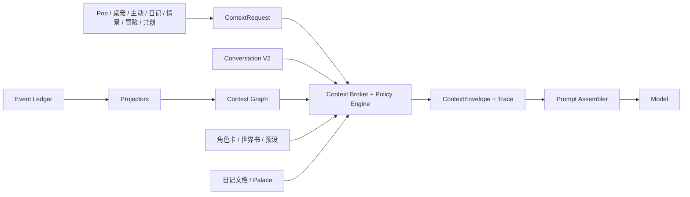

# 月栖企业级上下文管理系统一次性执行计划

> 代号：Context Pipeline Enterprise（CPE）  
> 版本：v1.2  
> 日期：2026-07-29  
> 执行对象：Cursor  
> 上游产品计划：`docs/CONTEXT_PIPELINE_REBUILD_PLAN.md`  
> 当前定级：**Product RED · partial implementation · verification incomplete**

---

## 0. 本文档怎么用

这不是建议清单，而是后续实现、迁移、测试和放行的唯一执行合同。Cursor 必须从第 1 节开始核实当前工作树，按第 8 节的波次依次执行，直到第 11 节全部通过。

禁止把以下情况称为“完成”：

- 新建了若干文件，但 Pop 仍走旧历史或旧 Prompt；
- 单元测试只检查源码里出现了某个字符串；
- `npm run build` 成功，但上下文重复、串角色或预算溢出；
- 用固定 fixture、预制 Prompt 或离线假回复代替真实运行路径；
- 只迁移 Pop，主动消息、日记、桌宠仍各自拼上下文；
- 把 `implementation_green` 写成 `product_review`；
- 未运行隐私、分支、迁移和预算测试就声称“企业级”。

Cursor 不得覆盖或回滚工作树里与本计划无关的用户改动。参考项目只用于理解语义，禁止复制其代码、文案、样式和专有资产。

---

## 1. 当前真实起点

Codex 已经开始过一次实现，但用户随后要求停止编码并交给 Cursor。下列文件存在**部分实现**，只能作为起点，不能直接判绿：

| 文件 | 当前内容 | 未完成/风险 |
|------|----------|-------------|
| `src/context/contract.js` | ContextRequest、Envelope、6k/8k/12k 档 | 缺多 App 权限矩阵、模型窗口适配、完整 schema 验证 |
| `src/context/short-term.js` | 按消息边界选择近期历史 | 缺超长当前消息策略、群聊、附件 token、性能测试 |
| `src/context/history-authority.js` | Conversation V2 优先、IDB 对账迁移 | 当前按角色找 active session；**群聊会污染角色 DM**，必须重构映射 |
| `src/context/branch-summary.js` | 分支摘要存储和抽取式兜底 | fingerprint 只含长度，存在碰撞；缺 Conversation 事件失效、并发锁、迁移 |
| `src/context/cohabit-projector.js` | 12 条候选、最多 5 条注入 | 评分与折叠未完整验收；底层仍是 localStorage v1 |
| `src/context/moments-projector.js` | 授权朋友圈投影 | UI 没有授权开关；旧数据迁移、作者身份、导入来源未完成 |
| `src/context/broker.js` | 初版中心 Broker | 仍需完善 purpose policy、外部上下文、Palace/日记、错误模型和多 App 接入 |
| `src/context/extraction.js` | ADD/UPDATE/DELETE/NOOP 初版 | 模型结果缺严格证据校验；删除与更新授权仍不够安全 |
| `src/prompt/budget.js` | 硬预算与边界裁剪初版 | 缺真实模型窗口、消息开销、结构块 property tests |
| `src/worldbook/activation.js` | 近轮激活、before/after 初版 | 旧测试未更新；sticky/cooldown 状态、scope、位置语义仍需验证 |
| `src/prompt/assemble.js` | 初步接入 Broker、去 system 历史 | 当前测试合同仍是旧顺序；需要清理旧 fallback/旧 import/运行时重复 system |
| `src/panels/chat.js` | V2 写入 metadata、异步摘要/抽取初版 | 写入失败恢复、分支 ID、续聊语义和竞态未完成 |
| `src/proactive/pipeline.js` | 初步读取 Broker | 还没有完整按 Envelope 生成消息；需去掉所有重复上下文拼装 |
| `src/diary/generate.js` | 初步改读 V2 | 角色/日期/分支隔离和日记专用召回未完成 |
| `src/memory/cohabit-timeline.js` | 增加 scope、consent、quarantine | 旧数据和全部写入点尚未迁移 |
| `src/moments/store.js` | 修复 authorId 初版并增加授权字段 | 创建/编辑 UI 尚未写入这些字段 |
| `src/characters/profile.js` | 暴露卡级 prompt | 仍需验证 Prompt 优先级和导入导出 |

当前已知验证结果：

- `npm run build`：通过，但只有编译意义；
- `verify:core-w2`：**38/41**，旧 canonical 顺序断言失败；
- 尚无 `verify:context-enterprise`；
- 尚无完整浏览器 E2E；
- 尚无隐私、群聊、迁移、删除传播、摘要分支失效和硬预算综合证据。

因此 Cursor 第一步不是重写全部文件，也不是沿用“已经完成”的口径，而是对上表逐项审计、修正和验收。

---

## 2. 产品语义：这个系统到底负责什么

企业级上下文系统不是“把更多内容塞进 Prompt”。它必须让同一个长期陪伴角色在不同入口中：

1. 知道当前正在和谁、在哪个会话、哪条世界线互动；
2. 只看到被授权给 TA 的事实、共同经历和外部信息；
3. 能延续长期关系，但不会把别的角色、别的分支或被删除内容串进来；
4. 能解释某段上下文为什么被使用、来自哪里、花了多少 token；
5. 在模型失败、摘要失败、数据库迁移失败时仍然诚实，不编造“记得”；
6. Pop、桌宠、主动消息、日记、情景、冒险、共创共享同一套治理规则，但使用不同 purpose policy；
7. 任何内容源都不能越过平台安全、角色边界和用户权限。

### 2.1 四类上下文

| 层 | 内容 | 是否常驻 | 权威来源 |
|----|------|----------|----------|
| Soul | 平台规则、角色卡、关系状态、模式契约、回复预设 | 是，受硬预算 | Character Store + Prompt Policy |
| Implicit | 分支摘要、长期事实、日记命中、世界书命中、同栖/朋友圈/日历投影 | 按需 | Context Broker 的检索结果 |
| History | 当前分支最近原始消息 | 是，按 token 截窗 | **Conversation V2** |
| Current | 当前真实用户输入、附件说明或明确的“继续回复”意图 | 是 | 当前交互事件 |

### 2.2 五个已经拍板的产品决定

1. **同栖进入 Pop**，但“最近 12 条”只是候选池，实际注入 3–5 条、250–400 token；
2. **朋友圈有条件进入模型**：月栖内用户动态可单条选择“让 TA 看到”；导入/外部动态默认关闭；
3. **默认总输入预算为 8k**，另有 6k 紧凑档、12k 深聊档；不得把 8k 理解成单独的聊天历史预算；
4. **滚动摘要允许自动调用模型**，但必须异步、可失效、可回退，不能阻断聊天；
5. **Conversation V2 是唯一权威历史源**，IDB `messages` 仅用于旧 UI/兼容投影和迁移恢复。

---

## 3. 最终架构



### 3.1 ContextRequest 最低字段

```ts
type ContextRequest = {
  contractVersion: 1;
  requestId: string;
  purpose: "chat" | "deskpet" | "proactive" | "diary" | "scenario" | "adventure" | "cocreate";
  appId: string;
  userId: string;
  workspaceId: string;
  conversationKind: "dm" | "group" | "scenario" | "project";
  chatSessionId: string;
  conversationSessionId?: string;
  characterId?: string;
  participantIds: string[];
  activeSpeakerId?: string;
  branchId?: string;
  currentInput: string;
  turnIntent: "user_message" | "continue" | "regenerate" | "proactive";
  locale: "zh-CN" | "en";
  modelContextLimit: number;
  outputReserveTokens: number;
  budgetProfile: "compact" | "balanced" | "deep";
  allowedSources: string[];
  allowedPrivacyLevels: string[];
};
```

### 3.2 ContextEnvelope 最低字段

```ts
type ContextEnvelope = {
  contractVersion: 1;
  request: ContextRequest;
  authority: {
    history: "conversation_v2";
    conversationSessionId: string;
    branchId: string;
    migration?: object;
  };
  preHistoryBlocks: ContextBlock[];
  historyMessages: ModelMessage[];
  postHistoryBlocks: ContextBlock[];
  currentMessage?: ModelMessage;
  provenance: ProvenanceRow[];
  redactions: RedactionRow[];
  tokenUsage: {
    modelLimit: number;
    outputReserve: number;
    inputLimit: number;
    used: number;
    byBlock: Record<string, number>;
  };
  trace: object;
};
```

所有模型调用方只能消费 Envelope，不能再次读取 localStorage/IDB 自拼第二份历史或记忆。

---

## 4. 权威源和隔离规则

### 4.1 会话映射必须重构

当前 partial `history-authority.js` 通过 `characterId` 找 active Conversation V2 session，这不足以支持企业级隔离。必须建立明确映射：

```text
legacy chatSessionId -> conversationV2SessionId
```

映射至少保存：

- `chatSessionId`
- `conversationSessionId`
- `conversationKind`
- `characterId`（DM）
- `participantIds`（群聊/多人情景）
- `createdAt / migratedAt / lastReconciledAt`
- `migrationVersion`

规则：

- DM：一个 `char:<characterId>` 对应一个 V2 DM session；
- 群聊：一个 `group:<id>` 对应独立 V2 group session，绝不能写入某个角色的 DM active session；
- 情景剧：作品 run/session 独立，可绑定同一角色，但不与 Pop DM 共用 branch；
- 共创：项目会话独立，不能进入恋爱聊天历史；
- 桌宠：读取当前 DM 会话，但使用 `purpose=deskpet` 的短契约；
- 主动消息：读取目标 DM 会话，只能使用 shared 且允许 proactive 的上下文。

### 4.2 IDB 迁移规则

1. 迁移是显式、幂等、可审计的，不允许每轮静默二选一；
2. 每个 legacy message 使用稳定 `legacyMessageId`；
3. 去重键优先 `legacyMessageId`，其次使用 `role + normalizedContent + createdAt`，禁止只按文本去重；
4. 迁移完成写 migration marker；
5. 单条迁移失败进入 repair queue，Inspector 显示，不得悄悄改读 IDB；
6. V2 写成功后，IDB 只接受投影写；
7. 编辑、重生成、候选切换只改变 V2，IDB 投影反映“当前可见世界线”，不能破坏旧候选。

---

## 5. Prompt 顺序与安全语义

最终模型消息顺序必须是：

```text
system: platform safety + role/mode contract + character package
system: relationship state + worldbook(before) + implicit context + branch summary
messages: Conversation V2 当前分支最近原文
system: worldbook(after) + runtime action contract + output contract + continue/regenerate intent
user: 当前真实用户消息（只有 turnIntent=user_message 才存在）
```

### 强制规则

- `branch_history` 永远不得出现在 system 文本；
- “点角色回复/继续”不得伪造并持久化一条用户消息；使用 `turnIntent=continue` 的 post-history system 指令；
- `chat.js` 不得再在最终 payload 中临时 `splice` 一段第二套 runtime system；它必须作为 Assembler 的 contribution；
- 世界书、日记、朋友圈、网页、文件、同栖 summary 都按“资料”包装，不能覆盖平台规则；
- 卡级 `promptSystem/promptDeveloper` 属于 character package，优先级低于平台规则和 App 契约；
- Prompt Inspector 必须显示最终消息数组中的真实位置，而不是只显示逻辑块名称。

---

## 6. Token 预算合同

### 6.1 三档配置

| 档位 | 总输入上限 | 建议输出预留 | History 目标 | 使用场景 |
|------|------------|--------------|--------------|----------|
| compact | 6000 | 1400 | 约 3000–3400 | 桌宠、移动端、省成本模型 |
| balanced | 8000 | 1800 | 约 4400–5000 | Pop 默认 |
| deep | 12000 | 2400 | 约 6500–7200 | 长聊、用户明确开启 |

若模型声明的上下文窗口小于配置，实际输入上限必须自动降到：

```text
modelContextLimit - outputReserveTokens - providerSafetyMargin
```

### 6.2 裁剪顺序

1. 当前真实用户输入；
2. 平台安全与 App 契约；
3. 角色核心设定；
4. 最近消息；
5. 分支摘要；
6. 高相关世界书/长期记忆；
7. 同栖/朋友圈/外部近况；
8. 低相关资料。

规则：

- 历史只能按完整 message 裁剪；
- 世界书、记忆和事件只能按完整 item 裁剪；
- JSON、协议消息、工具结果不能被切成半段；
- 当前输入单独超过上限时返回明确的 `CURRENT_INPUT_TOO_LARGE`，不能静默截句；
- 每个模型 provider 可以提供 tokenizer adapter；没有 adapter 时使用保守估算并增加安全余量；
- 发送前必须有最终硬断言：`inputTokens <= inputLimit`。

---

## 7. 数据模型

### 7.1 Event Ledger

同栖、朋友圈授权事件、日历、情景谢幕、转账、一起听/看等先写 Event Ledger，再由 projector 产生可用上下文。

最低字段：

```ts
type ContextEvent = {
  id: string;
  schemaVersion: number;
  eventType: string;
  actorId: string;
  participantIds: string[];
  characterId?: string;
  sourceApp: string;
  sourceRef: string;
  idempotencyKey: string;
  summary: string;
  payloadRef?: string;
  occurredAt: string;
  createdAt: string;
  visibility: "shared" | "private" | "discoverable";
  consentState: "explicit" | "in_app_action" | "missing_scope";
  retention: string;
  deleted: boolean;
  deletedAt?: string;
};
```

不能继续以“localStorage 最近 80 条”作为最终企业级存储。建立 repository，优先使用现有 IDB/SQLite 抽象；localStorage v1 只作为迁移输入和降级缓存。

### 7.2 Context Memory

最低补充字段：

- `memoryStatus: pending | accepted | confirmed | disputed | superseded`
- `evidenceRefs: string[]`
- `subjectType / subjectId`
- `audienceCharacterIds`
- `consentState`
- `version / supersedesId`
- `idempotencyKey`
- `createdAt / updatedAt / occurredAt`
- `privacyLevel / retention / expiresAt`
- `deleted / deletedAt`

模型推断但没有用户原文证据的内容只能是 `pending`，不能进入角色 Prompt。

### 7.3 Branch Summary

键：

```text
characterId + conversationSessionId + branchId
```

版本必须保存：

- `headMessageId`
- `sourceMessageIds`
- `sourceCandidateIds`
- 基于消息 ID、候选 ID、内容哈希的 `sourceFingerprint`
- `summary`
- `source=model|extractive`
- `status=active|superseded|invalidated`
- `createdAt / invalidatedAt / invalidationReason`

禁止使用“字符串长度”作为 fingerprint。

---

## 8. 一次性实施波次

## W0 — 基线与 partial 收口

### 任务

1. 读取本文第 1 节列出的所有 partial 文件；
2. 记录当前相关 diff，不覆盖其他工作；
3. 修复所有语法、未使用旧分支和明显重复逻辑；
4. 给 `ContextRequest/Envelope` 写 schema validator；
5. 更新 `docs/CONTEXT_PIPELINE_REBUILD_PLAN.md` 为 v1.2，并链接本文；
6. 新增 `docs/qa/context-enterprise/EXECUTION_STATE.md`，初始必须是 Product RED。

### 验收

- `npm run build` 通过；
- partial 文件全部可 import；
- 没有把现有失败测试删除或改成字符串扫描；
- 状态板明确写出剩余红项。

## W1 — P0 权威历史与最终 Payload

### 任务

1. 实现 DM/group/scenario/project 会话映射；
2. Conversation V2 成为唯一权威；
3. 实现 IDB 幂等迁移、repair queue 和审计；
4. 重构 `assemblePrompt/buildModelMessages` 为 pre-history / messages / post-history / current；
5. 删除 production path 的 system `branch_history`；
6. 将 runtime action contract 合并进 Assembler；
7. 实现 `turnIntent=continue/regenerate`，不伪造用户消息；
8. 修正所有写入顺序：先写 V2，成功后写 IDB projection；失败必须可恢复且可见；
9. 桌宠传入 `purpose=deskpet`，不再实际走 Pop 默认契约。

### 验收场景

- 用户发一次转账，模型 payload 里只出现一次；
- 连点两次“角色回复”，V2 没有新增 user node；
- 切换 assistant candidate 后，只发送选中候选；
- 编辑旧 user message 后自动分支，原分支保持不变；
- 群聊消息不进入任一成员 DM；
- 情景剧历史不进入 Pop DM；
- 同一 legacy 数据迁移运行三次，V2 数量不增加。

## W2 — P1 Event Ledger 与同栖

### 任务

1. 建立 Event Ledger repository 和 v1 localStorage 迁移；
2. 修复所有 `appendCohabitEvent` 调用点；
3. 无 participant/character 的旧事件进入 quarantine，不得注入；
4. 播放、阅读进度按 idempotencyKey 折叠；
5. 转账、订单、约定、情景谢幕保留更高事件权重；
6. projector 使用最近 12 条合法候选，按相关性/新鲜度/重要度选 3–5 条；
7. 同栖总预算 250–400 token；
8. 删除/撤回事件后，下一次构建立即不再出现；
9. Life/sidewrite 与同栖去重，不能同一经历注入两遍。

### 验收场景

- A 与用户听歌，A 能自然提到；B 完全看不到；
- 连续拖动同一首歌进度 30 次，Prompt 只出现一个最新状态；
- 无角色旧事件不进入任何角色 Prompt；
- 删除事件后立即消失；
- 12 条候选实际注入不超过 5 条和 400 token。

## W3 — P4 世界书

### 任务

1. 激活文本使用当前句 + 最近 2–4 轮、最多 800–1200 token；
2. 当前句权重最高；
3. 真正实现 before-history 与 after-history；
4. 删除 `activateWorldInfo` 为空时回退旧 matcher 的生产路径；
5. 世界书独立预算，单条过大时按完整语义单元缩减或跳过；
6. sticky/cooldown/delay 状态按 conversation+branch 保存；
7. scopeApps、character、session、experience 全部有合同测试；
8. 角色卡绑定世界书优先于全局同优先级条目；
9. 世界书内容按资料/角色设定处理，不得覆盖 platform safety；
10. 情景/冒险复用同一 activation helper，删除双注。

### 验收场景

- 当前句无关键词、上一轮含关键词时可激活；
- A 角色世界书不进入 B；
- `post_history` 条目确实位于历史之后；
- 被预算裁掉的条目不能从旧 matcher 回来；
- 无命中时角色承认没有相关设定，不编“整本世界书”。

## W4 — P2 分支摘要与日记

### 任务

1. 摘要在历史达到约 65% history budget 或 12–16 轮后触发；
2. 只总结即将被淘汰的前缀，最近原文永不总结掉；
3. 异步单飞：同一 branch 同时最多一个摘要任务；
4. 模型失败保留旧摘要；无旧摘要时使用明确标注的 extractive fallback；
5. 监听 Conversation events：edit、regenerate、switchCandidate、fork、rollback、archive 后正确失效；
6. 摘要来源范围改变时产生新版本，旧版 superseded；
7. 停止读取全局 `palaceSessionDiary`；可归属旧数据才迁移，否则 quarantine；
8. 日记 App 保持长期文档语义；
9. “今天/昨天/某日的日记”强制走 `diary.memory` + 日期过滤 + character scope；
10. 日记生成从 V2 当前可见分支读取，不读 IDB 第二份历史。

### 验收场景

- 30 轮长聊后较早约定仍可被摘要延续；
- 切候选后旧候选内容不在摘要；
- A 的日记问答不读 B；
- 用户问“昨天日记”返回真实命中要点；没有日记时明确说没有；
- 摘要模型报错，主聊天仍正常完成。

## W5 — P3 证据化长期记忆、角色卡与朋友圈

### 任务

1. 抽取器输出 ADD/UPDATE/DELETE/NOOP；
2. 每个操作必须引用 user message ID 和可验证原文 span；
3. Assistant 文本不能单独建立用户事实；
4. 用户明确事实可 accepted；模型推断只能 pending；
5. UPDATE 创建新版本并 supersede 旧版；
6. DELETE 写 tombstone，并从所有检索/摘要/主动消息中传播；
7. 冲突事实标记 disputed，最近一条不能直接覆盖明确旧事实；
8. 抽取异步，不阻断回复；失败进入重试队列但不制造记忆；
9. 卡级 prompt 接到 character package；导入、编辑、导出、复制角色均保留；
10. 朋友圈 UI 增加“让 TA 看到”和角色范围；
11. 月栖内用户动态可默认共享给当前 TA，但必须可单条关闭；
12. imported/external 默认不共享；角色动态只归属作者角色；
13. 点赞、评论默认不进 Prompt；
14. 朋友圈最多 1–3 条、150–250 token，按相关性或用户明确提问召回。

### 验收场景

- 助手说“你喜欢咖啡”但用户没说过，不会形成事实；
- 用户说“我不喝咖啡”，可形成有证据的偏好；
- 用户纠正后旧事实不再召回；
- 删除后 Pop、桌宠、主动消息都看不到；
- A 可见动态不会被 B 读取；
- 外部导入动态默认完全不进模型。

## W6 — P5 多 App Policy 与治理

实现并固化下表：

| purpose | History | Summary | Context Graph | Cohabit | Moments | Worldbook | 特殊限制 |
|---------|---------|---------|---------------|---------|---------|-----------|----------|
| chat | 当前 DM/group branch | 是 | shared | 是 | 授权时 | pop scope | IM 契约 |
| deskpet | 当前 DM 最近短窗 | 可选短摘要 | shared | 是 | 仅高相关 | deskpet/pop 兼容 | 更短回复 |
| proactive | 目标 DM 少量最近消息 | 是 | shared + allowProactive | 是 | 默认不主动提私密动态 | proactive scope | 可选择 SILENCE |
| diary | 当日当前分支 | 不作为输入主干 | 仅辅助 | 可选 | 可选 | 否 | 输出日记文档 |
| scenario | scenario branch | 场景摘要 | 角色长期记忆只读 | 写谢幕事件 | 否 | experience scope | 开放 RP 契约 |
| adventure | adventure session | 游戏摘要 | 只读必要角色信息 | 写完成事件 | 否 | adventure scope | DM 状态机 |
| cocreate | project session | 项目摘要 | 默认不读恋爱私密 | 只写作品里程碑 | 否 | project lore | 写作工具契约 |

迁移调用方：

- `src/prompt/assemble.js`
- `src/panels/chat.js`
- `src/proactive/pipeline.js`
- `src/diary/generate.js`
- 桌宠宿主提交路径
- scenario director/runtime
- adventure DM
- cocreate talk/write

完成后搜索并删除生产路径中自行调用 `getMessagesBySession + 拼字符串` 的第三套历史；确有必要的 UI 读取必须注明 `display_only`。

## W7 — Inspector、备份、迁移和用户控制

### Inspector

每次构建显示：

- requestId、purpose、角色、会话、分支；
- 历史权威源和迁移状态；
- 最终消息顺序；
- worldbookHits、memoryHits、cohabitHits、momentHits、diaryHits；
- 每项 sourceId、命中原因、score、token；
- 被裁掉/脱敏/隔离的原因；
- 摘要版本与来源消息范围；
- 总输入、输出预留和硬预算。

### 用户控制

- 查看“TA 为什么记得”；
- 编辑、冻结、删除、禁止主动使用；
- 单角色分享范围；
- 朋友圈单条授权；
- 外部上下文授权；
- 导出和清空。

### 备份/恢复

更新：

- `src/memory/backup.js`
- `src/memory/data-modules.js`
- 全量 ZIP/JSON 导出恢复

必须覆盖 Conversation mapping、Event Ledger、Context Graph、Branch Summary、Moments consent。恢复重复执行不得生成重复事件或记忆。

## W8 — 企业级验证与合并验收

新增：

```text
scripts/verify-context-enterprise.mjs
e2e/context-enterprise.spec.mjs
fixtures/context-enterprise/
docs/qa/context-enterprise/
```

`package.json` 增加：

```json
{
  "verify:context-enterprise": "node scripts/verify-context-enterprise.mjs",
  "e2e:context-enterprise": "node e2e/context-enterprise.spec.mjs"
}
```

测试必须实际 import 并执行 production functions，不得只 `rg` 文件或检查字符串。

---

## 9. 必须覆盖的测试矩阵

### 9.1 权威历史

- DM、群聊、情景、项目四类会话隔离；
- IDB 三次迁移幂等；
- V2 写失败 repair；
- 分支、候选、编辑、回滚、归档；
- continue 不新增 user node；
- 最终 payload 同一 messageId 只出现一次。

### 9.2 隐私与角色隔离

- 至少 1000 个 A/B/C 混合 memory/event/moment fixture；
- 错角色泄漏必须为 0；
- private/sensitive/forbidden policy；
- proactive 不能读取 forbidProactive；
- 无 scope 旧数据不得进入任意 Prompt；
- 删除和撤回下一次请求立即生效。

### 9.3 检索质量

- 至少 200 条人工标注查询；
- 目标上下文 Top-5 命中率 ≥90%；
- 无关注入率 ≤5%；
- 日期日记查询命中正确日期；
- 同栖 12 候选最多注入 5；
- 朋友圈只有授权内容。

### 9.4 Budget

- 6k/8k/12k 三档；
- 超大世界书、超长日记、200 条消息、混合中英文；
- 最终 input 永不超过硬限制；
- current input 超限返回显式错误；
- 不产生半个 JSON、半个事件或半条消息；
- property test 随机生成至少 1000 组 blocks。

### 9.5 摘要

- 阈值前不生成；
- 只总结淘汰前缀；
- 同 branch 单飞；
- 编辑/切候选/分支后失效；
- 模型失败回退；
- 旧摘要与新原文冲突时以新原文为准。

### 9.6 多 App

- 每种 purpose 至少一个合同测试；
- 共创不读恋爱私密；
- 主动消息可 SILENCE；
- 桌宠契约短于 Pop；
- scenario lore 不双注；
- 日记不读 IDB 第二历史。

### 9.7 性能

在 5000 条记忆、1000 条事件、200 条动态下：

- Desktop 本地 Context 构建 P95 ≤150ms；
- 中端 Android 目标 P95 ≤250ms；
- 不含 embedding/LLM 网络时间；
- 超时必须降级为较少上下文并记录 trace，不能阻断主聊天。

---

## 10. 证据和状态纪律

状态只能按以下顺序提升：

```text
Product RED
  -> contract_green
  -> implementation_green
  -> evidence_green
  -> product_review
  -> user_accepted
```

### 每波必须留下

```text
docs/qa/context-enterprise/Wx/
  REVIEW.md
  VERIFY.json
  FAILURES/
```

W8 额外留下：

- `EXECUTIVE_SUMMARY.md`
- `TRACEABILITY_MATRIX.md`
- `LIMITATIONS.md`
- `MIGRATION_REPORT.json`
- `PRIVACY_MATRIX.json`
- `BUDGET_MATRIX.json`
- Playwright trace、截图和录屏

任何一项自动测试失败，状态保持 Product RED 或当前阶段，不得在摘要里用“整体已完成”掩盖。

---

## 11. 最终放行红线

全部满足才允许写 `product_review`：

1. 同一历史消息重复注入：**0**；
2. 角色/会话/分支错误泄漏：**0**；
3. 无 scope 同栖事件注入：**0**；
4. 删除、拒绝、归档、未选候选召回：**0**；
5. Prompt 超模型硬预算：**0**；
6. 所有注入项具备 provenance：**100%**；
7. 世界书预算回退绕过：**0**；
8. current user message 被静默截断：**0**；
9. 200 条标注检索 Top-5 ≥90%，无关注入 ≤5%；
10. 自动摘要失败不影响主回复；
11. IDB/Conversation V2 迁移三次幂等；
12. Pop、桌宠、主动、日记、情景、冒险、共创全部走 ContextRequest；
13. `npm run build`、既有相关回归、`verify:context-enterprise`、`e2e:context-enterprise` 全绿；
14. 用户亲自走一遍“聊天 → 一起听 → Pop 回忆 → 发动态 → 分支重生成 → 写日记 → 删除记忆 → 主动消息”黄金旅程。

达到 `product_review` 仍不等于 `user_accepted`。Cursor 不得替用户签字。

---

## 12. Cursor 的最终交付格式

执行结束时只能按以下格式报告：

```text
定级：Product RED / evidence_green / product_review（三选一，按证据）

已完成：
- 按 W0-W8 列出真实行为变化

自动验证：
- 命令、通过数、失败数

人工验证证据：
- 路径、录屏、trace

仍未完成：
- 逐条写，不得省略设备/外部模型/性能限制

需要用户验收：
- 一条黄金旅程和具体观察点
```

禁止只汇报“新增多少文件、多少测试”，必须汇报用户能感知的行为和仍然存在的风险。

