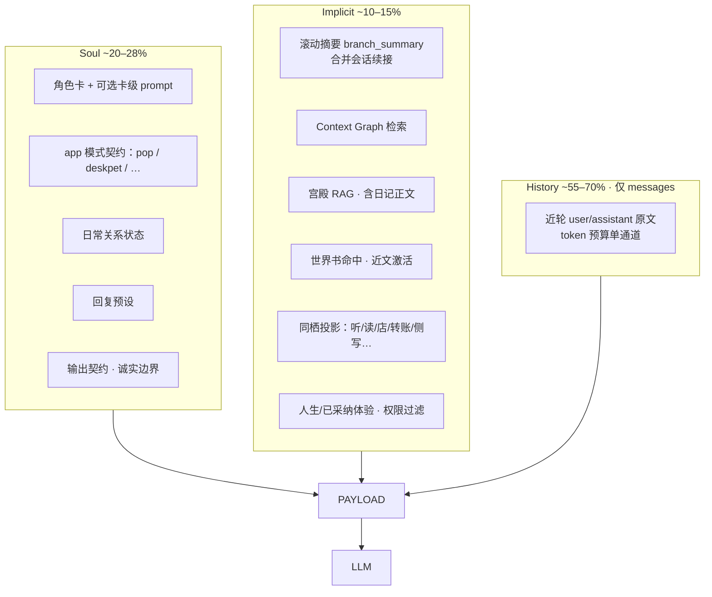

# 月栖聊天上下文链路重建计划

> 代号：Context Pipeline Rebuild（CPR）  
> 日期：2026-07-29（v1.1 · 产品货架对齐）  
> 对照：月栖真实产品面（优先）· `F:\商业参考\ai-virtual-phone` · 企业级综述 · `PERSONAL_AI_OS` P2  
> 状态：待授权开工

> **一次性工程执行合同：** [`CONTEXT_PIPELINE_ENTERPRISE_EXECUTION_PLAN.md`](./CONTEXT_PIPELINE_ENTERPRISE_EXECUTION_PLAN.md)。后续实现、迁移、测试、证据与放行以该 v1.2 文档为准；本文件保留产品盘点与问题背景。

---

## 0. 立场：参考是方法，产品是约束

上一版偏「抄参考组装器」。v1.1 改为：

1. **先盘月栖已经写了什么、用户以为 TA 记得什么**  
2. **再决定 Pop 热路径该接哪些、哪些该诚实不接**  
3. 参考只提供手法（单通道历史、token 窗、激活世界书、续写契约、滚动摘要）

禁止两件事：把参考 100k 预算原样搬进手机；用硬截断伪装 IM。

---

## 1. 产品货架：谁在写、谁进模型、谁在撒谎

### 1.1 Pop 聊天热路径（`compilePrompt` → `assemblePrompt` · **永远 `appId: "pop"`**）

| 产品面 | 存哪 | 现在进不进 Pop | 用户以为 | 真相 |
|--------|------|----------------|----------|------|
| **角色卡**（名/称呼/身份/底色/四维/偏好词） | IDB `characters` | ✅ `character_package` | TA 就是这个人 | 卡上的 `promptSystem` **未接线** |
| **模式契约**（IM 口语） | `mode-contributions` + `CHAT_POST_HISTORY_CONTRACT` | ✅ | 像微信 | 正确方向；勿再硬截句 |
| **回复预设** | `yueqi.presets.v1` | ✅ 并入 platform_safety | 换预设改语气 | OK |
| **日常状态** | `yueqi.dailyStatus.v1` | ✅ `relationship_state` | 知道天气心情 | OK |
| **世界书** | IDB `worldbook` | ⚠️ 仅**当前 query** 激活，预算 ~800 | 整本设定可查 | 命中才注；`scopeApps≠pop` 的条目在聊天**永不触发**；`insertPosition` 未兑现 |
| **宫殿 RAG / 日记正文** | IDB `memories`（含 `diary.memory`） | ⚠️ `shouldRecall` 才检 | 写过的日记她都记得 | 多数时候不检索；日记 App 几乎是**只写不读** |
| **宫殿「会话续接」** | `settings.palaceSessionDiary` | ✅ 塞进 `long_term_memory` | 容易和「日记 App」混淆 | 这是聊天摘要条，不是日记本 |
| **Context Graph** | `yueqi.context.graph.v1` | ✅ 热路径抽取后注入 | 长期小事实 | 仍偏正则，非 Mem0 |
| **聊天历史** | IDB `messages` + Conversation V2 | ⚠️ **双通道** + 两套读法可能不一致 | 能看见自己说过的 | system 文本 + messages 各写一遍；ConvV2≠IDB |
| **同栖时间线**（听/读/店/转账/侧写…） | `yueqi.cohabit.timeline.v1` | ❌ canonical **不注** | 「我们一起听过/读过」 | 各 App 狂写，Pop **看不见** |
| **外部上下文**（日历授权等） | `integrations/context` | ❌ 收集了但无 canonical 块 | 日历提醒进聊天 | 孤儿 |
| **朋友圈** | `yueqi.phone.moments.v1` | ❌ | 发过动态 | 纯 UI |
| **人生投影 / 侧写条** | life / sidewrite | ⚠️ 部分进 `long_term_memory` | 共同经历 | 规则不透明 |
| **已采纳体验** | `yueqi.experience.memory.v1` | ✅ 进 `mode_context` | 玩过的情景 | OK，CPR 此前未写 |
| **branch_summary** | 槽位存在 | ❌ 恒空 | 长聊压缩 | 空跑 |

### 1.2 日记：两种完全不同的东西（计划必须拆开）

| 名字 | 是什么 | 谁写 | 进 Pop？ |
|------|--------|------|---------|
| **日记 App**（`diary.memory`） | 用户/定时生成的日记正文 | `diary/generate.js`、日记本 UI | 仅当宫殿 RAG 命中 |
| **宫殿会话续接** | 每轮回复后一行摘要 | `writeSessionDiary` @ chat | 每轮注入最近 2 条 |

产品期望应对齐为：

- 日记 App = **可检索的长期文本**（问「昨天日记」应走召回，不是编）  
- 会话续接 = **短时 MTM**，将来与滚动 `branch_summary` 合并，避免两套摘要打架  

### 1.3 世界书：产品规则 vs 实现缺口

已有：全局/角色/人格/体验/会话 scope、keys、regex、constant、预算、手机端编辑页。  

缺口（必须进计划）：

1. 激活上下文 = **近 N 轮**，不是只看当前一句  
2. 兑现 `insertPosition`（至少 before / after；depth 二期）  
3. Pop 聊天应对 **character-scoped + global** 条目可靠；`scopeApps` 与硬编码 `appId:"pop"` 要对齐文档  
4. 契约：禁止角色假装「打开了整本世界书」  

### 1.4 不同应用的 system / 组装器（不能假装只有 Pop）

| App | 组装器 | 与 Pop 共享？ | 计划策略 |
|-----|--------|---------------|----------|
| **Pop 聊天** | `assemblePrompt` + `buildModelMessages` | 主路径 | **CPR 主战场** |
| **桌宠** | 代码有 `deskpet` mode，**无人传 appId** | 实际走 Pop | P0.6：接线 `deskpet` 短契约，或删死代码 |
| **主动消息 / 日历提醒** | `proactive/pipeline.js` 自拼 | 否 | 共用短时窗+世界书激活 helper，禁止再造第三套历史 |
| **日记生成** | `diary/generate.js` | 否（读 24h 消息写日记） | 保持独立；写完入库供 RAG |
| **情景剧 / 舞台** | `director-adapter` / experience director | 否 | 修 lore 双注；可选复用 worldbook 激活 helper |
| **漫卷 Gal** | `scroll/vn-engine` 极简 | 否 | 保持轻量；角色名来自卡 |
| **冒险** | `adventure/dm.js` | 否 | 包内 lore；同栖只写不读→P1 投影进 Pop |
| **共创 talk/写作** | cocreate 自拼 | 否 | 保持项目圣经；不污染 Pop |
| **一起听 / 一起看 / 栖店** | 无 LLM，只 `appendCohabit` | — | **同栖必须能被 Pop 读到**（见 P1） |

`SCENE_SECTION_POLICY`（listen/read 禁世界书等）已写好但 **主聊天从不换 appId** → 政策死代码。要么 Pop 始终 pop；要么按「当前前台 App」切换——产品上 Pop 应始终 pop，**跨 App 经历靠同栖投影进 Implicit，而不是改 appId**。

### 1.5 角色记忆（用户口中的「她记得我」）

拆成四层，避免混谈：

| 层 | 内容 | 现状 | 目标 |
|----|------|------|------|
| **人格** | 卡字段、四维、偏好词、预设 | 大部分 OK；卡级 prompt 未接 | 接线或从 UI 去掉 |
| **关系状态** | 日常心情/睡眠/昨日基调 | OK | 保留 |
| **情节记忆** | Context Graph + 宫殿抽屉 | 半通 | P3 强化抽取 |
| **共同经历** | 同栖时间线（听歌、共读、转账、侧写、情景） | **写多读无** | P1 进 Implicit |

---

## 2. 目标架构（产品面驱动）



### 硬约束（验收红线）

1. 历史 **不得** 同时出现在 system 与 messages。  
2. 续点「角色回复」≠ 用户又发消息。  
3. 世界书 / 日记 / 同栖：**有则用注入内容，无则承认没有**，禁止百科编造。  
4. IM = 契约，不是截断。  
5. **跨 App 经历** 要么进入 Implicit 投影，要么产品文案不再暗示「她什么都记得」。

---

## 3. 分期（按产品面重排）

### P0 — Pop 语义正确（1–2 天）

| # | 改动 | 产品意义 |
|---|------|----------|
| P0.1 | 废除 chat 热路径 `branch_history` 双写；`buildModelMessages` 统一读源 | 不再复读/假上下文 |
| P0.2 | 续写契约（空点生成） | 转账不三连谢 |
| P0.3 | 诚实契约：世界书/日记/内部结构 | 问「全说出来」不胡说 |
| P0.4 | 旁白清洗加强，不截语义 | 少（画笔…） |
| P0.5 | Conv V2 vs IDB：**选定一个权威历史源** | 消除分裂脑 |
| P0.6 | 桌宠：接线 `deskpet` mode 或删除死分支 | 不同 App 的 system 名实相符 |

### P1 — 短时窗 + **同栖进 Pop**（产品关键缺口）

| # | 改动 | 产品意义 |
|---|------|----------|
| P1.1 | `prepareShortTermContext` token 预算 | 替代死板 20 条 |
| P1.2 | **同栖时间线投影**进 `long_term_memory`（最近 K 条、按角色过滤、预算封顶） | 「一起听/读/转账」真能被聊到 |
| P1.3 | 外部/日历：要么进 Implicit 一条「近期约定」，要么关掉收集 | 消灭孤儿 collect |
| P1.4 | 协议消息可读化（转账/位置） | 模型少当小说写 |

### P2 — 日记与摘要理顺

| # | 改动 | 产品意义 |
|---|------|----------|
| P2.1 | 滚动 `branch_summary`；与宫殿会话续接 **合并策略**（一个写、一个读或统一） | 长聊不蒸发 |
| P2.2 | 日记 App：问日记类意图时 **强制召回** `diary.memory`（放宽/专用 shouldRecall） | 日记不只是装饰 |
| P2.3 | UI/文案区分「日记本」与「会话续接」 | 防产品语义混乱 |

### P3 — 角色记忆（Context Graph + 宫殿）

| # | 改动 |
|---|------|
| P3.1 | 可选 LLM 抽取 ADD/UPDATE/DELETE，走现有 pipeline |
| P3.2 | 卡级 `promptSystem`/`promptDeveloper` 接线或从设定页移除 |
| P3.3 | 自适应检索（「还记得/上次」加重） |
| P3.4 | 朋友圈：可选「最近动态摘要」进 Implicit，或明确不进模型 |

### P4 — 世界书引擎（产品已有编辑面）

| # | 改动 |
|---|------|
| P4.1 | 激活上下文 = 近 N 轮 + 当前句 |
| P4.2 | before/after 注入位；独立预算 |
| P4.3 | 文档化 scope：`pop` 聊天命中规则；角色绑定条目优先 |
| P4.4 | 情景剧/冒险：复用激活 helper，修 theater lore 双注 |

### P5 — 多 App 组装纪律（治理）

| # | 改动 |
|---|------|
| P5.1 | 抽出共享包：`short-term` / `worldbook-activate` / `cohabit-project` / `sanitize` |
| P5.2 | 主动消息、日记生成 **调用共享包**，禁止复制第三套历史 |
| P5.3 | 漫卷/共创/冒险保持轻量，但写同栖时格式统一，便于 P1 投影 |
| P5.4 | `SCENE_SECTION_POLICY`：仅当真正传入非 pop appId 的 LLM 路径时生效；文档写清 |

### P6 — 采样与去复读（并行）

frequency/presence penalty、同轮复句折叠——不替代 P0–P1。

---

## 4. 验收（必须覆盖产品面）

1. **历史**：转账一点一回；再点续聊不三连。  
2. **世界书**：无命中时承认；有命中只谈注入条目；近文能激活（不靠当前句关键词碰运气）。  
3. **日记**：写过日记后问「今天日记写了啥」→ 能召回要点（非纯编造）。  
4. **同栖**：一起听/发位置/转账后，Pop 能自然提到（Implicit 可见）。  
5. **角色**：改人设四维后下一轮语气变化；卡级 prompt 若保留则生效。  
6. **多 App**：桌宠若存在，契约短于 Pop；情景剧不污染 Pop 的 IM 契约。  
7. **Spy**：同段 history 不双出现；注入面板列出 worldbookHits / memoryHits / cohabitHits / diaryHit。

---

## 5. 与参考的映射（收束）

| 参考手法 | 落在月栖哪块产品 |
|----------|------------------|
| 单通道历史 | Pop messages；修双写 |
| 短时 token 窗 | Pop + 主动消息共享 |
| 世界书近文激活 | 世界书 App（已有编辑） |
| 滚动摘要 | 会话续接 + branch_summary + 日记召回策略 |
| Mem0 抽取 | Context Graph（角色记忆） |
| 跨 App 时间线 | **同栖**（月栖特有，参考里叫 recent_* 投影） |

---

## 6. 建议开工序

```
P0（Pop 单通道·续写·诚实）
 → P1（短时窗 + 同栖进聊天）  ← 产品体感最大
 → P4（世界书近文激活）
 → P2（日记/摘要理顺）
 → P3（角色记忆抽取）
 → P5（多 App 共享包治理）
 → P6（采样）
```

---

## 7. 开工前确认

1. **P0 → P1** 是否同意（P1 含同栖进 Pop，不只是条数）？  
2. 同栖投影默认保留最近几条？（建议 **8–12 条**、~400–600 token 封顶）  
3. 朋友圈：**进 Implicit 摘要** 还是 **明确永不进模型**？  
4. 短时预算：6k / 8k / 12k？  
5. 滚动摘要是否允许自动调模型？
