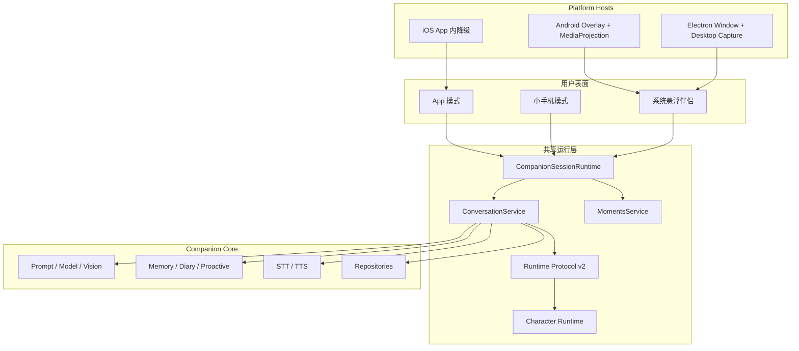

# 月栖跨端悬浮 AI 伴侣实施计划

> 版本：2.0（屏幕感知与双模式修订版）  
> 更新日期：2026-07-21  
> 适用项目：`F:\beautiful`  
> 参考项目：`E:\AIPlatform\warmland-effect`，仅学习产品结构和数据契约，不作为源码依赖  
> 当前状态：已有聊天、记忆、语音、角色编辑、Android Overlay 和 Windows Electron 原型；屏幕感知、悬浮窗真实聊天、宿主内动态角色、小手机模式和朋友圈尚未形成发布级闭环

## 0. 一句话目标

把月栖做成一个可直接交付的跨端 AI 恋爱伴侣：角色以可动的系统悬浮形态常驻在 Android 和 Windows 上，用户可以让她看当前屏幕并以文字气泡、语音、表情包和动作实时回应；完整管理界面称为 **App 模式**，沉浸式虚拟手机界面称为 **小手机模式**。

本计划不建设商城、支付、订单后台、激活码或复杂商业平台，只保证产品、角色包和技术依赖具备直接商业交付条件。

---

## 1. 产品边界纠正

### 1.1 两种应用模式和一个系统入口

| 表面 | 定位 | 主要内容 |
|---|---|---|
| **App 模式** | 当前完整应用的正式名称 | 聊天、陪伴、日记、朋友圈、角色外表与动作编辑、记忆、世界书、语音和接口设置 |
| **小手机模式** | 角色世界里的沉浸式手机壳 | 桌面、Pop 聊天、朋友圈、相册、日记、一起听、设置 |
| **系统悬浮伴侣** | Android / Windows 跨应用入口 | 可动角色、屏幕观察、文字气泡、语音、快捷聊天、表情和动作 |

规则：

- App 模式和小手机模式共享同一份角色、会话、记忆、语音、朋友圈和媒体数据。
- 系统悬浮伴侣是第三个宿主表面，不是第三套业务实现。
- 小手机模式不是系统悬浮窗，也不复制一套聊天和朋友圈数据库。
- iOS 不承诺 Android 同款任意跨应用悬浮；首版只提供 App 内体验和系统入口降级。

### 1.2 妹居物语提供的体验标杆

需要对齐的是体验结果，而不是照抄界面：

1. 角色本身是入口，不是一个带头像的工具球。
2. 角色持续有待机、眨眼、呼吸和情绪动作，不在回复时才突然换图。
3. 用户明确授权后，角色能看到当前屏幕并围绕画面内容说话。
4. 同一次回复可以由短文字、语音、表情包、表情和动作共同组成。
5. 聊天、关系记忆、主动陪伴、朋友圈和屏幕观察属于同一个角色连续性。

不把以下内容当作首版目标：复杂游戏剧情、桌面物理、窗口攀爬、全双工语音模型、公开社交网络。

---

## 2. 已核实的项目基线

### 2.1 `beautiful` 已有能力

- 聊天、流式回复、历史上下文、RAG、世界书、日记和记忆宫殿。
- 主动消息、生活状态、日历、纪念日和免打扰。
- 麦克风录音、STT、TTS、语音条和自动朗读。
- 图片附件和多模态模型输入。
- Runtime Protocol v1：`emotion / expression / actions / voice`。
- 可编辑外表、动作、表情、时间轴、角色包和 PixiJS / Canvas 分层 2D。
- Android `TYPE_APPLICATION_OVERLAY` 前台服务原型。
- Windows Electron 透明置顶窗、托盘、拖动、吸边和点击穿透原型。

### 2.2 当前关键缺口

| 能力 | 当前实际情况 | 目标 |
|---|---|---|
| 悬浮角色 | 宿主接收压缩后的静态外表或动作快照 | 宿主直接运行共享角色渲染器和动作状态机 |
| 悬浮聊天 | “聊天态”只有最近文字和“打开 App” | 悬浮窗内真实输入、流式回复、表情、语音和历史 |
| 屏幕感知 | 没有系统屏幕采集 | Android MediaProjection / Windows desktop capture 接入视觉对话 |
| Android 输入 | Overlay 长期 `FLAG_NOT_FOCUSABLE` | 展开聊天时可聚焦并调起软键盘，收起后恢复不抢焦点 |
| 聊天消息 | 主要保存 `role + content` | 结构化消息、多部件、状态、引用、视觉上下文和 Runtime 结果 |
| 表情包 | 没有完整目录和消息链 | 本地表情目录、角色包绑定、用户选择和 AI 白名单选择 |
| 世界页 | Mock 资讯流和只读 Adapter | 本地持久化的朋友圈，支持角色发帖、点赞和评论 |
| 应用外壳 | 只有当前主应用 | App 模式 + 小手机模式，共享业务数据 |

### 2.3 对 `AIPlatform` 的取舍

可学习：

- Pop 的消息类型、连续消息 buffer、短气泡节奏和通话状态。
- 表情包的“描述供模型理解、素材由本地渲染”思路。
- 图片压缩、视觉 payload、STT、TTS 和 `listening / thinking / speaking` 状态。
- 朋友圈的发布、多图、点赞、评论、回复和角色自动互动模型。
- 小手机的桌面、Dock、App 路由和 Pop 四个 Tab 的信息架构。

必须重写：

- 文本标签加正则的 `[STICKER:] / [VOICE:]` 协议，改为结构化 Runtime Protocol v2。
- 远程 URL 表情包，改为本地受控素材和角色包资产。
- 巨型 `WeChatApp.tsx`，改为可测试的独立业务模块。
- 两套并存的朋友圈存储，改为唯一的 `MomentsService` 和 Repository。

不能从中获得：

- Android 系统悬浮和 MediaProjection。
- Windows 系统屏幕采集宿主。
- 真正跨应用的角色生命周期和权限处理。
- 可确认的商业源码许可。没有明确许可前，只学习行为和契约，不复制实现代码。

---

## 3. 目标体验

### 3.1 悬浮角色状态机

```text
companion   仅角色，持续待机动画
peek        角色 + 一句短气泡
mini_chat   最近消息 + 输入框 + 麦克风 + 看屏幕 + 表情
listening   正在听用户说话，显示音量和取消
capturing   正在取得屏幕上下文，有明确可见指示
thinking    已收到输入，角色出现思考动作
speaking    文字流式出现或 TTS 播放，口型同步
error       权限、网络或模型失败，给出可恢复操作
```

主要转换：

```text
点击角色            companion -> peek
点“聊聊”            peek -> mini_chat
点眼睛              任意可交互态 -> capturing -> thinking -> speaking
点麦克风            mini_chat -> listening -> thinking -> speaking
主动消息            companion -> peek -> 超时回 companion
点击空白或收起       peek / mini_chat -> companion
长按角色            打开锁位置、换装、静音、关闭和设置菜单
```

### 3.2 屏幕感知对话

提供两种明确入口：

1. **看一下**：用户点击眼睛，只取一帧，得到回复后立即结束采集。
2. **陪我看**：用户主动开启一个限时采集会话，持续显示系统和 App 内指示，按 4 至 8 秒或画面明显变化采样，用户可随时停止。

数据链：

```text
用户手势
  -> Platform Host 请求系统授权
  -> 获取一帧屏幕内容
  -> 排除或临时隐藏月栖自身窗口
  -> 旋转校正、缩放、压缩
  -> 生成临时 ScreenContext
  -> ConversationService 结合聊天、关系和记忆调用视觉模型
  -> Runtime Protocol v2
  -> 文字气泡 / TTS / 表情包 / 角色动作
  -> 默认删除原始截图，只保留必要的文字摘要
```

限制：

- 模型可以建议“让我看看”，但不能自行开启屏幕采集。
- 不进行隐形常驻截屏，不在开机时自动恢复采集会话。
- 遇到安全窗口、黑屏、撤销授权或不支持的模型时明确降级，不假装看到了。
- 首版只做关键帧理解，不做 30 FPS 视频持续上传。

### 3.3 回复表现

一次角色回复允许组合：

- 1 至 4 个短文字气泡。
- 一条 TTS 语音或语音条，复用现有角色音色设置。
- 0 或 1 个本地表情包。
- 角色表情、动作、口型和气泡展示策略。
- “我看到的画面”上下文标记，方便用户知道回复基于哪次截图。

默认先流出文字；TTS、动作或表情失败只能降级，不能阻断聊天。

### 3.4 聊天复杂度升级

首版消息类型：

- `text`
- `image`
- `screen_capture`
- `voice`
- `sticker`
- `reply`
- `system`

交互能力：

- 连续发送缓冲，避免用户连发三句时触发三次互相打架的回复。
- 短气泡拆分和逐条送达节奏。
- 发送中、已发送、失败、重试、已读和正在输入状态。
- 引用回复、复制、删除本地记录、重新生成和语音重播。
- 用户发语音时优先回语音；仍保留文字字幕和无声降级。
- 图片与屏幕截图进入同一视觉输入管线，但来源和留存策略不同。
- 主动消息和正常回复共享消息模型，使用 `source` 区分。
- Runtime、TTS 和动作只消费最终一次回复，取消旧 generation，避免多人格或重复说话。

红包、转账、定位不是首版重点。它们增加界面类型，但不会优先改善屏幕陪伴和恋爱关系体验。

---

## 4. 目标架构



### 4.1 Headless `ConversationService`

当前 `wireChatPanel` 同时处理 DOM、模型、存储、记忆、Runtime 和 TTS，导致悬浮宿主无法复用。第一项基础工程是抽出无 DOM 的对话服务：

```text
sendTurn(input, options) -> Async Event Stream

turn.user_committed
turn.thinking
turn.delta
turn.runtime_ready
turn.voice_ready
turn.done
turn.failed
```

App 模式、小手机模式和悬浮窗只负责渲染事件，不各自调用模型和写存储。

同一平台进程只能有一个活跃 `CompanionSessionRuntime`：

- Windows 由 Electron 主进程或 utility process 持有，两个 Renderer 通过 IPC 使用。
- Android 在系统悬浮开启时由 Service 侧 Runtime 持有，MainActivity 通过绑定和事件通信。
- Web / PWA 没有原生宿主时由主页面持有。

这条约束用于消除重复回复、重复 TTS 和 App/悬浮窗状态冲突。

### 4.2 Runtime Protocol v2

```json
{
  "version": 2,
  "outputs": [
    { "kind": "text", "text": "你这局打得有点凶哦" },
    { "kind": "sticker", "stickerId": "yuki_surprised" },
    { "kind": "voice", "text": "慢点，我都看紧张了", "style": "soft" }
  ],
  "performance": {
    "emotion": "surprised",
    "expressionId": "eyes_wide",
    "actions": [{ "id": "look_at_screen", "at": "start" }]
  },
  "presentation": {
    "bubble": "caption",
    "ttlMs": 6500
  }
}
```

规则：

- `stickerId / expressionId / action id` 必须在当前角色包白名单内。
- LLM 不输出 URL、文件路径、脚本、窗口命令或采集命令。
- v1 纯文字和原 Runtime envelope 保持兼容，经 Adapter 转为 v2。
- 解析失败时使用纯文本、`talking_default` 和默认表情。
- 屏幕截图属于输入 `ScreenContext`，不是模型可以创建的输出动作。

### 4.3 结构化消息

```json
{
  "id": "msg_...",
  "conversationId": "default",
  "companionId": "yuki",
  "sender": "companion",
  "seq": 128,
  "status": "sent",
  "parts": [
    { "kind": "text", "text": "这张图好可爱" },
    { "kind": "sticker", "stickerId": "heart_01" }
  ],
  "replyTo": null,
  "source": "screen_observation",
  "contextRefs": ["screen_ctx_..."],
  "runtime": {},
  "createdAt": "2026-07-21T00:00:00.000Z"
}
```

需要提供旧 `role + content` 消息的幂等迁移，并保留可回滚的数据库版本号。

---

## 5. 真动态角色和动作系统

### 5.1 不再向宿主只发送图片快照

App 向 Host 同步：

- `characterPackageId`
- `lookId`
- 显示参数和资源版本
- Runtime action / expression 事件

Host 本地加载角色包，并运行同一个 `Character Runtime`。这样 animated WebP、序列帧、透明视频、Canvas / Pixi 分层角色、表情和口型才能在系统悬浮中持续播放。

### 5.2 首版动作目录

| 场景 | 默认动作 |
|---|---|
| 待机 | `idle_default`、呼吸、眨眼、轻微摆动 |
| 点击 | `react_tap` |
| 睡觉 | `sleep_pose`（右键菜单 / sleep 场景） |
| 打招呼 | `greet`（右键菜单） |
| 自拍 | `selfie`（右键菜单） |
| 拖动 | `dragging`、`drag_release` |
| 看屏幕 | `look_at_screen`、`screen_surprised`、`screen_curious` |
| 思考 | `thinking` |
| 说话 | `talking_default` + 口型 |
| 听用户 | `listening` |
| 安慰 | `comfort` |
| 主动出现 | `proactive` → `comfort` |

**桌宠多动作 MVP（已实现）：** Windows Electron 右键菜单触发 `greet` / `selfie` / `sleep_pose` / `idle_default`；宿主优先显示动作姿势图，无图时程序化姿态降级。不做行走、不做一图生成。

所有动作都允许用户在现有编辑器中替换、调时长、设循环、优先级、是否可打断和 fallback。

### 5.3 视觉质量要求

- 透明角色本身作为主视觉，不放进圆形头像框。
- 气泡锚定角色并自动选择左右方向，不遮挡角色脸和屏幕主要操作区。
- 动作切换提供最小淡入淡出或帧过渡，避免直接闪图。
- 活跃交互目标 30 FPS；纯待机自适应到 12 至 15 FPS；隐藏或不可见时暂停渲染。
- TTS 播放时沿用现有音量分析口型；无音频时使用轻量伪口型降级。
- 低端设备、素材损坏或渲染器失败时回退为轻动态或静态立绘。

---

## 6. 表情包和角色包

### 6.1 表情包数据

角色包新增：

```text
stickers.json
assets/stickers/*
```

建议字段：

```json
{
  "id": "yuki_surprised",
  "name": "吓一跳",
  "description": "惊讶地看着你",
  "tags": ["surprised", "game"],
  "aliases": ["惊讶", "吓到"],
  "asset": "assets/stickers/yuki_surprised.webp",
  "mimeType": "image/webp",
  "animated": true,
  "triggerEmotions": ["surprised"],
  "weight": 1
}
```

### 6.2 功能

- 聊天和悬浮 mini chat 共用表情面板。
- 用户可导入、分组、搜索、排序、预览和删除自有表情。
- AI 只能从当前角色允许的 `stickerId` 中选择。
- 表情包可以绑定接收动作，例如收到爱心表情时播放害羞动作。
- animated WebP / GIF 必须有缩略图、尺寸、帧数和文件大小限制。

### 6.3 可直接商业交付规则

- 官方角色包默认只包含自制或有明确商业授权的本地素材。
- 不以任意远程 URL 作为商业角色包正式资产。
- 每个素材记录作者、来源、授权范围、哈希和版本。
- ZIP 导入校验路径穿越、压缩炸弹、MIME、重复 ID、无效引用和总大小。

---

## 7. App 模式、小手机模式和朋友圈

### 7.1 App 模式

保留当前信息密度和创作能力，作为主要管理界面：

- 聊天
- 陪伴
- 朋友圈（替换当前“世界”主入口）
- 角色与动作
- 生活、日记、相册、日历
- 我的、记忆、世界书、语音、模型和平台设置

“世界书”仍是角色设定能力，保留在设定中；它与“朋友圈”不是同一概念。

### 7.2 小手机模式

首版只做必要应用，不复制一个复杂假操作系统：

```text
桌面
  Pop
    聊天
    通讯录
    朋友圈
    我
  相册
  日记
  一起听
  设置
```

- 手机端全屏显示；Windows / 大屏居中显示手机壳。
- 顶层提供 `App 模式 | 小手机模式` 分段切换，记住用户选择。
- 首版不做三屏桌面、图标自由拖动、复杂 Widget 和仿系统通知中心。
- 小手机里的 Pop 消息与 App 模式聊天完全相同，只改变导航和视觉呈现。

### 7.3 朋友圈

替换当前 Mock 世界资讯流，建立唯一的数据模型：

- 用户和角色发布文字、最多九图或表情动态。
- 点赞、取消点赞、评论、回复评论和删除自己的内容。
- 角色按照人设生成短评论和点赞选择。
- 主动陪伴系统可以按频率生成角色动态，但必须受免打扰、关系和生活状态约束。
- App 模式使用宽屏单列/双栏布局；小手机 Pop 使用单列手机布局；两者读取同一 Repository。
- 默认本地私域，不建设公开社区、关注流、审核后台和推荐算法。
- 从记忆或日记生成动态前必须经过隐私过滤，不能自动公开用户敏感信息。

---

## 8. 平台宿主

### 8.1 Android

保留当前 `OverlayService`，但拆清职责：

```text
OverlayService
  透明角色窗口、mini chat、拖动、吸边、键盘焦点、动作渲染

ScreenCaptureService
  MediaProjection 授权会话、VirtualDisplay、帧获取、停止和系统通知

CompanionSessionRuntime
  对话、视觉、记忆、TTS、Runtime v2 和消息落盘
```

必须完成：

- `SYSTEM_ALERT_WINDOW` 授权、返回检测、拒绝和撤销降级。
- MediaProjection 每次新采集会话都走系统同意流程。
- Android 14+ 使用 `mediaProjection` 前台服务类型和对应权限。
- 采集会话持续显示通知和悬浮指示，系统撤销时立即停止并释放资源。
- 收起态保持 `FLAG_NOT_FOCUSABLE`；mini chat 输入时临时切换为可聚焦，关闭后恢复。
- 键盘、横竖屏、刘海、安全区、字体缩放和多窗口状态可恢复。
- 采集前排除、隐藏或遮罩月栖自身 Overlay，防止截图递归出现角色。
- 遇到 `FLAG_SECURE`、黑帧或受管设备禁用截图时给出真实提示。
- 麦克风仅在用户主动录音期间工作；不用常驻监听模拟“实时”。
- 前台通知提供“返回月栖”“停止看屏幕”“关闭悬浮”。
- 小米、华为、OPPO / vivo、三星和接近原生 Android 至少各有一条权限与后台恢复记录。

### 8.2 Windows

在现有 Electron 主进程上增加：

- `desktopCapturer / getDisplayMedia` 屏幕或窗口选择。
- 系统选择器优先；不在后台偷偷指定敏感窗口。
- 角色窗和主 App 从采集源中排除、隐藏或做内容保护，并进行实机验证。
- 单次截图和限时“陪我看”会话。
- Electron 主进程持有唯一 Session Runtime，主窗和桌宠窗通过 IPC 订阅同一事件。
- mini chat 内直接发送文字、语音、表情和看屏幕请求。
- 透明区域点击穿透只在 companion 态启用；聊天和菜单态必须可交互。
- 多屏、负坐标、DPI、任务栏位置、全屏应用、锁屏和显示器热插拔恢复。
- 托盘、开机启动、静音、停止采集和退出行为保持一致。

### 8.3 实施顺序

共享 Core 和 Character Runtime 完成后，Windows 与 Android 可以并行。

单人顺序建议先做 Windows 端到端样板，再做 Android：Windows 能更快验证“角色真的在动、能看屏幕、能回复并说话”的完整产品体验；Android 随后处理 MediaProjection、前台服务、软键盘和厂商兼容。Android 仍是正式跨应用移动端验收门槛，不因 Windows 样板而降级。

### 8.4 iOS

首版范围：

- App 模式和小手机模式。
- App 内悬浮角色。
- 通知、Widget / Live Activity 的合规系统入口评估。
- 屏幕共享能力单独做原生技术验证，不承诺与 Android Overlay 相同的自由悬浮交互。

不采用伪装视频播放来绕过系统限制。

### 8.5 官方技术依据

- Android [Media projection](https://developer.android.com/media/grow/media-projection)：每个新采集会话需要用户同意，Android 14+ 需要对应前台服务声明和权限。
- Android [Foreground service types](https://developer.android.com/develop/background-work/services/fgs/service-types)：`mediaProjection`、麦克风和其他前台服务类型按真实用途分别声明。
- Electron [desktopCapturer](https://www.electronjs.org/docs/latest/api/desktop-capturer/)：通过桌面媒体源和系统选择器建立 Windows 屏幕或窗口采集。
- Apple [Picture in Picture](https://developer.apple.com/documentation/avkit/adopting-picture-in-picture-in-a-standard-player) 和 [ReplayKit](https://developer.apple.com/documentation/replaykit)：iOS 只在系统允许的媒体播放、录制和共享入口内评估，不将其描述为 Android Overlay 等价物。

---

## 9. 隐私、安全和数据保留

### 9.1 屏幕数据

- 原始截图默认只存在内存或临时文件，视觉请求结束后删除。
- 会话历史默认只保留“用户让角色看过屏幕”和模型生成的文字摘要，不保存原图。
- 用户可以显式选择“把这张截图保存到聊天”，此时才进入媒体库和备份。
- 日志不得记录截图 base64、完整 OCR 文本、API Key 或用户语音内容。
- 设置页明确显示截图将发送给哪个模型供应商。
- 提供应用排除列表、暂停观察和一键删除屏幕上下文记录。

### 9.2 密钥与存储

- Android API Key 使用 Keystore 包装；Windows 使用系统凭据或 DPAPI；iOS 使用 Keychain。
- Repository 提供事务、迁移、损坏恢复和备份版本。
- 角色包与表情包安装采用临时目录校验后原子替换。
- 同步默认不上传大型角色资产和临时截图。

### 9.3 直接商业化许可

- 生产依赖优先 MIT、Apache-2.0、BSD、ISC 等可直接商用许可。
- 排除需要另签商业协议、运行时版税、收入分成或非商业限制的 SDK。
- 继续使用 PixiJS / Canvas 和自有 JSON，不引入 Live2D Cubism、Spine 等需额外商业确认的运行时。
- 发布包生成第三方依赖清单和 `THIRD_PARTY_NOTICES`。
- `E:\AIPlatform` 仅作行为参考，未确认许可前不复制源码和素材。

---

## 10. 分阶段交付与退出门槛

### Phase 0：冻结契约和迁移策略

交付：

- `ConversationMessage v2`
- `Runtime Protocol v2`
- `ScreenContext`
- `StickerAsset`
- `Moment / Comment / Like`
- v1 消息和 Runtime 的兼容 Adapter

退出门槛：schema 有单元测试、版本号、非法输入 fallback 和旧数据迁移样例。

### Phase 1：共享对话内核和复杂聊天

交付：

- 从 `wireChatPanel` 抽出 Headless `ConversationService`。
- 连续消息 buffer、generation 取消、短气泡、状态、引用、重试和多部件消息。
- 图片、语音、表情和 Runtime v2 统一事件流。
- App 模式先接入新 Core，确保行为不回退。

退出门槛：同一测试会话可从 App UI 和无 UI 测试 Harness 发起，产生相同消息、记忆、Runtime 和 TTS 结果；不存在重复回复。

### Phase 2：真动态悬浮角色和企业级 UI

交付：

- Character Runtime 在独立 Overlay 页面直接加载角色包。
- companion / peek / mini_chat / listening / capturing / thinking / speaking 状态。
- 新的透明角色、锚定气泡、快捷输入、麦克风、眼睛和表情面板。
- 动作编辑器增加屏幕观察和语音状态触发。

退出门槛：Web Host Harness 中角色持续待机，文字流式时动作和口型正确，状态转换不改窗口布局，不再依赖静态动作快照。

### Phase 3：Windows 端到端样板

交付：

- 桌宠窗真实聊天。
- 屏幕/窗口选择、单次截图、限时观察。
- 视觉回复、文字气泡、TTS、表情和动作完整闭环。
- 多屏、DPI、托盘、穿透、崩溃恢复。

退出门槛：在另一个测试应用中点击“看一下”，角色能基于可验证的画面元素回复；同一回复可文字显示并使用现有语音播放；截图中不递归出现月栖；拒绝或停止采集后不再取得新帧。

### Phase 4：Android 端到端样板

交付：

- Overlay mini chat 真输入和软键盘。
- MediaProjection 单次与限时会话。
- 前台服务、通知、授权、撤销、横竖屏和进程恢复。
- Android Host 中运行同一 Character Runtime、ConversationService 契约和角色包。

退出门槛：App 退到后台后，在其他 App 上方完成“看屏幕 -> 视觉回复 -> 气泡或语音 -> 动作”；关闭采集或悬浮后资源释放；至少覆盖原生系、三星和三类国产 ROM 真机。

### Phase 5：小手机模式和朋友圈

交付：

- `App 模式 | 小手机模式` 切换。
- 小手机桌面、Pop、相册、日记、一起听和设置。
- 当前“世界”入口替换为朋友圈。
- 用户/角色发帖、九图、点赞、评论、回复、自动动态和隐私过滤。

退出门槛：两个模式显示同一条聊天和朋友圈记录；切换模式不复制数据、不丢状态；角色自动评论符合当前人设且不会泄漏私密记忆。

### Phase 6：发布级加固

交付：

- Android 真机矩阵和 Windows 安装包矩阵。
- 数据迁移、断网、模型超时、权限撤销、低内存、崩溃恢复和升级测试。
- 角色包安全、依赖许可、隐私说明、日志脱敏和密钥存储。
- Playwright 视觉回归、Canvas 像素检查、Android 截图记录和性能基线。

退出门槛：第 12 节发布门禁全部有证据，不以“代码存在”代替真机和安装包验收。

---

## 11. 建议模块边界

```text
src/conversation/
  conversation-service.js
  message-schema.js
  message-buffer.js
  turn-events.js
  generation-controller.js

src/vision/
  screen-context.js
  image-prepare.js
  vision-input.js
  retention-policy.js

src/runtime/
  protocol-v2.js
  protocol-v1-adapter.js
  session-runtime.js

src/stickers/
  sticker-schema.js
  sticker-repository.js
  sticker-picker.js

src/moments/
  moments-service.js
  moments-repository.js
  moment-generation.js

src/phone-shell/
  phone-shell.js
  phone-router.js
  pop/

src/overlay/
  overlay-app.js
  overlay-state-machine.js
  overlay-chat.js
  overlay-character.js

android/.../overlay/
android/.../capture/
electron/capture/
electron/session/
```

禁止再次把聊天、通话、朋友圈、角色和设置集中进一个巨型页面文件。

---

## 12. 企业级发布门禁

### 12.1 契约和数据

- [ ] v1 -> v2 消息迁移可重复执行且不产生重复消息。
- [ ] Runtime、表情、动作、角色包和朋友圈 schema 有非法输入测试。
- [ ] App、小手机和悬浮宿主共享同一会话顺序和唯一消息 ID。
- [ ] App 与 Overlay 同时存在时只有一个 Session Runtime 发起模型请求。

### 12.2 核心体验

- [ ] 系统悬浮角色运行真实动画，而不是定时替换静态图。
- [ ] 悬浮 mini chat 可直接文字输入、流式显示、语音输入和表情发送。
- [ ] Android 和 Windows 都能完成可验证的屏幕视觉回复。
- [ ] 视觉回复可选择文字、语音或两者，沿用同一角色音色。
- [ ] TTS、表情、动作或高级渲染失败时文字聊天仍可用。
- [ ] 世界主入口已经是持久化朋友圈，世界书仍留在设定。
- [ ] App 模式与小手机模式读取同一份数据。

### 12.3 权限和隐私

- [ ] 拒绝、撤销和系统停止屏幕采集后立即停止取帧。
- [ ] 采集期间始终有系统或 App 内可见指示和停止入口。
- [ ] 原始截图默认不持久化、不进入日志、不自动进入备份。
- [ ] 安全窗口、黑帧和非视觉模型都有诚实降级。
- [ ] API Key 使用平台安全存储，发布日志完成脱敏检查。

### 12.4 质量和兼容

- [ ] Windows 多显示器、DPI、全屏、锁屏、休眠和热插拔通过。
- [ ] Android 权限、前台服务、键盘、横竖屏、杀进程和主要 ROM 通过。
- [ ] Overlay 活跃时无明显布局跳动、重复角色、重复回复或重复 TTS。
- [ ] 角色动画活跃态 30 FPS、待机低帧率和不可见暂停在参考设备上有测量记录。
- [ ] “陪我看”默认按 4 至 8 秒采样，不持续上传视频帧。
- [ ] 关键页面和 Overlay 状态完成桌面与移动视觉回归。

### 12.5 商业交付

- [ ] 生产依赖许可证无 `UNKNOWN / UNLICENSED / non-commercial`。
- [ ] 内置角色、动作、语音样例和表情素材有可追溯授权。
- [ ] 角色包可在干净设备导入、升级、回滚和删除。
- [ ] 不依赖商城、支付、订单后台或额外商业 SDK 才能交付定制角色。

---

## 13. 明确不做

- 不先做商城、支付、订单后台、SKU、激活码和设备授权平台。
- 不直接搬用许可不明的 AIPlatform 源码或素材。
- 不引入需要另谈商业许可的 Live2D Cubism、Spine 或类似运行时。
- 不把现有 Web 页内浮层当作系统悬浮完成证据。
- 不把“打开 App”按钮当作悬浮聊天态。
- 不做隐形连续截屏、后台常驻麦克风和模型自行开启采集。
- 不在首版追求全双工实时语音；先把现有 STT + LLM + TTS 做成稳定的半双工闭环。
- 不复制十几个无核心价值的小手机 App。
- 不把朋友圈做成需要公开社区和内容审核后台的社交平台。
- 不承诺 iOS 与 Android 拥有相同的跨应用自由悬浮能力。

---

## 14. 成功标准

完成后的用户体验必须能用一句话验收：

> 用户在 Android 或 Windows 的其他应用中看到持续活动的自定义角色，点“看一下”后明确授权屏幕采集；角色看懂当前画面，用短文字气泡或现有角色语音回应，同时播放正确表情和动作；展开后可继续聊天、发语音和表情，回到 App 模式或小手机模式时会话、记忆和朋友圈完全连续。

只完成 UI、权限按钮、静态角色、截图上传或“打开主 App”中的任何一项，都不算完成悬浮 AI 伴侣。
