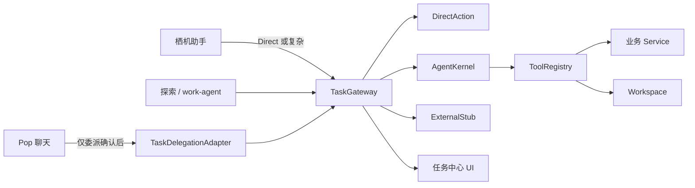

# Nyra Agent Runtime — 目标架构

> 计划代号：NAR  
> 仓库：`F:\beautiful`  
> 日期：2026-07-30  
> 状态：Phase 0 锁定（实施前蓝图）  
> 依据：`docs/NYRA_AGENT_RUNTIME_PLAN.md`、`docs/NYRA_AGENT_RUNTIME_AUDIT.md`

---

## 1. 目标模块布局（最终目录名）

审计结论：**扩展 `src/agent/`**，不新建顶层 `agent-runtime/`。

```text
src/
├── agent/                          # NAR 主落点（扩展现有 PAIOS agent）
│   ├── schema.js                   # 扩展：映射旧 TASK_STATES ↔ NAR TaskStatus
│   ├── task-store.js               # 扩展：经 storage/db 持久化 + Checkpoint
│   ├── executor.js                 # 保留：Direct / 单 capability 路径
│   ├── approvals.js                # 扩展：对接 Gateway.approve
│   ├── audit.js
│   ├── capabilities/               # 既有本地能力；注册进 Tool Registry
│   ├── ui/task-center-ui.js        # 扩展任务卡片字段
│   ├── task-gateway/               # ★ 新建
│   │   ├── index.js                # TaskGateway 门面
│   │   ├── types.js                # AgentTask、TaskEvent、TaskRequest
│   │   ├── router.js               # Direct | Local Agent | External
│   │   ├── event-bus.js            # subscribe(taskId, listener)
│   │   └── state-machine.js        # 状态迁移纯函数
│   ├── kernel/                     # ★ 新建
│   │   ├── index.js                # AgentKernel.run / resume
│   │   ├── loop.js                 # 有限步循环
│   │   ├── decision-schema.js      # AgentDecision JSON Schema
│   │   └── budgets.js              # maxSteps / tokens / timeouts
│   ├── context/                    # ★ 新建（任务上下文，隔离 Companion）
│   │   └── builder.js
│   ├── tools/                      # ★ 新建 Tool Registry
│   │   ├── registry.js
│   │   ├── schema.js               # AgentTool、riskLevel
│   │   └── adapters/               # 包装 studio-assist / capabilities / 业务
│   ├── policy/                     # ★ 新建
│   │   ├── capability.js
│   │   └── approval-policy.js
│   ├── workspace/                  # ★ 新建
│   │   ├── paths.js                # resolveTaskPath + Path Guard
│   │   ├── fs-adapter.js           # Native FS / Web 虚拟 FS
│   │   └── zip.js
│   ├── backends/                   # ★ 新建
│   │   ├── registry.js
│   │   ├── local-app.js
│   │   └── external-stub.js        # OpenClaw/Hermes/Generic 占位
│   ├── model/                      # ★ 新建
│   │   └── agent-model-provider.js # 基于 model/client.js
│   └── observability/
│       └── events.js
├── skill-platform/                 # Skill Registry（收敛，不平行）
├── studio-assist/                  # Direct Action 工具与审批 UX 来源
├── agents/                         # Explore Agent Profile（work-agent）
├── companion/                      # ★ 新建薄目录
│   └── TaskDelegationAdapter.js
├── runtime/companion-runtime.js    # 保持桌宠状态；不塞 Kernel
├── model/client.js                 # 底层 BYOK
└── storage/db.js                   # Checkpoint 目标存储
```

---

## 2. Companion vs Task Gateway 边界

```text
┌─────────────────────────────────────────────────────────────┐
│ Companion Runtime 职责                                        │
│ · Pop / 桌宠即时聊天（assemblePrompt + callModel）            │
│ · 人格、情绪、关系、长短期记忆、日记、朋友圈、主动消息          │
│ · 识别「需要动手」的意图（启发式 / 轻量分类，非完整 Loop）      │
│ · 经 TaskDelegationAdapter 委派（必须用户确认）                │
│ · 只接收：用户可见摘要、产物引用、关系向事件                    │
└───────────────────────────┬─────────────────────────────────┘
                            │ submit(委托) 经确认
                            ▼
┌─────────────────────────────────────────────────────────────┐
│ Nyra Task Gateway 职责                                        │
│ · 创建 / 路由 / 启停 / 恢复 / 取消 / 审批                        │
│ · 进度事件总线 → 任务中心 / 助手 / 探索卡片                    │
│ · 选择 executionMode：direct | local-agent | external         │
│ · Checkpoint 落库；不要求进程常驻                              │
└───────────────────────────┬─────────────────────────────────┘
                            │
              ┌─────────────┼─────────────┐
              ▼             ▼             ▼
         Direct Action  Local Kernel  External Stub
```

**硬规则**

1. 普通「今天好累」类聊天 **不得** `TaskGateway.submit`。  
2. Pop **不得**直接调用 `AgentKernel`。  
3. Tool 原始日志 **不得**写入恋爱聊天历史。  
4. `companion-runtime.js` 继续只做在场投影。

---

## 3. 三种执行模式

### 3.1 Direct Action

```text
TaskRequest
  → router 判定 known intent + 单步业务
  → policy（read/action 免确认；write/destructive 走审批）
  → studio-assist 工具或 agent/capabilities 或业务 Service
  → 结果 + 审计
```

接口名：`DirectActionExecutor.execute(intent): Promise<DirectResult>`  
优先复用：`executeAssistTool`、`getCapability(...).execute`。

### 3.2 Local Agent

```text
submit → ROUTING → PLANNING → RUNNING
  BUILD_CONTEXT → PLAN_NEXT_ACTION → VALIDATE_ACTION
  → EXECUTE_TOOL → OBSERVE → SAVE_CHECKPOINT
  → CONTINUE | WAITING_FOR_APPROVAL | SUCCEEDED | FAILED
```

接口名：`AgentKernel.run(task): AsyncIterable<AgentRuntimeEvent>`  
硬限制：`maxSteps`、模型调用上限、重试上限、token 预算、工具超时、总超时、取消检查。

### 3.3 External Execution

```text
canExecute === false | backend missing
  → status = WAITING_FOR_BACKEND
  → UI 明确说明；禁止伪造成功
```

接口名：`ExecutionBackend { id, canExecute, execute, cancel }`  
占位：`openclaw-stub`、`hermes-stub`、`generic-stub`。

---

## 4. 核心接口名（与计划 §7 对齐）

| 接口 | 模块路径 | 主要方法 |
|------|----------|----------|
| `TaskGateway` | `agent/task-gateway/index.js` | `submit` `get` `resume` `cancel` `approve` `subscribe` |
| `AgentKernel` | `agent/kernel/index.js` | `run` `resume` |
| `AgentTool` | `agent/tools/schema.js` | `name` `riskLevel` `capabilities` `execute` |
| `ToolRegistry` | `agent/tools/registry.js` | `register` `list` `get` `invoke` |
| `ExecutionBackend` | `agent/backends/registry.js` | `canExecute` `execute` `cancel` |
| `AgentModelProvider` | `agent/model/agent-model-provider.js` | `generateDecision` |
| `WorkspaceService` | `agent/workspace/` | `create` `resolveTaskPath` `list` `readText` `writeText` … |
| `TaskDelegationAdapter` | `companion/TaskDelegationAdapter.js` | `proposeDelegation` `confirmAndSubmit` |

### 4.1 状态映射（旧 PAIOS → NAR）

| 旧 `TASK_STATES` | NAR `TaskStatus` |
|------------------|------------------|
| `draft` | `CREATED` |
| `proposed` | `PLANNING` |
| `awaiting_approval` | `WAITING_FOR_APPROVAL` |
| `running` | `RUNNING` |
| `paused` | `PAUSED` |
| `completed` | `SUCCEEDED` |
| `failed` | `FAILED` |
| `cancelled` | `CANCELED` |
| （新增） | `ROUTING` `WAITING_FOR_BACKEND` |

过渡期：`schema.js` 提供 `toNarStatus` / `fromNarStatus`；任务中心同时识别两套直至迁移完成。

### 4.2 风险等级映射

| QIJI / studio-assist | PAIOS R* | NAR `riskLevel` |
|----------------------|----------|-----------------|
| `read` / `action` | R0–R1 | `safe` |
| `write` | R2 | `write` |
| `destructive` | R2–R3 | `destructive` |
| 外部 / Shell | R3 | `external` |

---

## 5. Phase 1–5 文件清单与接口

### Phase 1 — 领域模型 + 状态机 + 单测

| 文件 | 内容 |
|------|------|
| `src/agent/task-gateway/types.js` | `AgentTask` `TaskStatus` `TaskSource` `TaskCheckpoint` `TaskError` `TaskRequest` |
| `src/agent/task-gateway/state-machine.js` | `canTransition(from,to)` `transition(task,event)` |
| `src/agent/schema.js`（小改） | 导出映射辅助；保持旧常量兼容 |
| `tests/agent/nar-state-machine.test.js`（或仓库既有 test 布局） | 非法迁移拒绝；终端态不可复活 |

**接口：** `canTransition`、`transition`、`toNarStatus`、`fromNarStatus`。

### Phase 2 — Task Gateway + 持久化 + Event Bus + Mock Backend

| 文件 | 内容 |
|------|------|
| `src/agent/task-gateway/index.js` | `createTaskGateway(deps): TaskGateway` |
| `src/agent/task-gateway/event-bus.js` | `subscribe` / `emit` |
| `src/agent/task-gateway/router.js` | `route(request): executionMode` |
| `src/agent/task-store.js`（扩展） | Checkpoint 读写；目标 `storage/db` store |
| `src/agent/backends/local-app.js` | Mock / Direct 执行垫片 |
| `src/agent/backends/external-stub.js` | 恒返回 `WAITING_FOR_BACKEND` |
| `src/agent/backends/registry.js` | `registerBackend` `getBackend` |

**接口：** `TaskGateway` 全套；`TaskEvent`（`status` `progress` `approval` `artifact` `error`）。

### Phase 3 — Workspace + Path Guard + ZIP + 三端适配

| 文件 | 内容 |
|------|------|
| `src/agent/workspace/paths.js` | `resolveTaskPath(taskId, rel)` 拒绝 `..` / 绝对路径 / 跨任务 |
| `src/agent/workspace/fs-adapter.js` | Native → Capacitor Filesystem；Web → IDB/内存 |
| `src/agent/workspace/index.js` | `createWorkspace` `destroyWorkspace` |
| `src/agent/workspace/zip.js` | extract / create archive（复用既有 ZIP 工具若有） |

**接口：** `WorkspaceService`、`PathGuardError`。

### Phase 4 — Tool Registry + Schema + Capability + 风险

| 文件 | 内容 |
|------|------|
| `src/agent/tools/schema.js` | `AgentTool` `riskLevel` |
| `src/agent/tools/registry.js` | 单一注册表 |
| `src/agent/tools/adapters/assist-bridge.js` | 映射 `studio-assist` 工具 ID |
| `src/agent/tools/adapters/capability-bridge.js` | 映射 `agent/capabilities` |
| `src/agent/policy/capability.js` | 任务 `requiredCapabilities` 校验 |
| `src/agent/policy/approval-policy.js` | safe/write/destructive/external 规则 |

**接口：** `ToolRegistry.invoke(toolName, args, ctx)`（内部过 policy）。

### Phase 5 — Agent Kernel

| 文件 | 内容 |
|------|------|
| `src/agent/kernel/decision-schema.js` | `tool_call` / `request_approval` / `complete` / `fail` |
| `src/agent/kernel/budgets.js` | 步数/token/超时 |
| `src/agent/kernel/loop.js` | 有限循环实现 |
| `src/agent/kernel/index.js` | `AgentKernel` |
| `src/agent/context/builder.js` | 任务分层上下文 |
| `src/agent/model/agent-model-provider.js` | `generateDecision` → `callModel` |
| `src/agent/observability/events.js` | 脱敏运行指标 |

**接口：** `AgentKernel.run` / `resume`；`AgentRuntimeEvent`；`AgentDecision`。

---

## 6. Phase 6+ 接入预览（不在 Phase 0 实施）

| Phase | 要点 |
|-------|------|
| 6 | 业务工具：`nyra.character.*` `nyra.worldbook.*` `nyra.scenario.*` → 现有 Service |
| 7 | `ChangePlan` / Diff / 快照 / 回滚 |
| 8 | 助手：解释→聊天；已知→Direct；复杂→Gateway |
| 9 | 探索：统一 `TaskGateway.submit`；任务卡片 |
| 10 | `TaskDelegationAdapter`；**不改**普通 Pop 热路径 |
| 11 | 声明式 Skill 与 `skill-platform` 收敛 |
| 12 | External Backend 占位完善 |
| 13 | 安全回归 + `NYRA_AGENT_RUNTIME_COMPLETION_REPORT.md` |

---

## 7. 产品接入示意



---

## 8. 与 OpenClaw / Hermes 的架构关系

| | 月栖 NAR | OpenClaw / Hermes |
|--|---------|-------------------|
| 中心 | App 内 Task Gateway + Local Kernel | 常驻 Gateway / 多 Channel |
| 聊天 | Companion 短路径 | 消息即 Agent 回合（默认） |
| 沙箱 | Capability + Workspace 路径 | Docker / host shell（可选） |
| 外部 | 可插拔占位 | 核心能力之一 |
| 依赖 | **零** openclaw/hermes 包 | 自身发行版 |

---

## 9. Phase 1 建议立刻创建的文件

1. `src/agent/task-gateway/types.js`  
2. `src/agent/task-gateway/state-machine.js`  
3. `src/agent/task-gateway/index.js`（可先导出类型 + 未实现 stub 抛 `not_implemented`）  
4. 状态映射辅助（写入或旁挂 `src/agent/schema.js`）  
5. 对应单测文件（按仓库现有 `tests/` 或 `npm` 脚本约定）

可选占位（空目录 + 简短 README 即可）：`src/agent/kernel/`、`src/companion/`。

---

**锁定说明：** 本文目录名为 Phase 0 最终裁定；后续 Phase 仅可在审计修订下微调文件名，不得再引入平行的顶层 Runtime 包。
