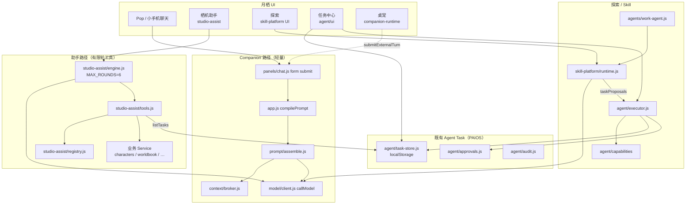

# Nyra Agent Runtime — Phase 0 仓库审计报告

> 计划代号：NAR  
> 仓库：`F:\beautiful`  
> 审计日期：2026-07-30  
> 状态：`PASSED`  
> 施工依据：`docs/NYRA_AGENT_RUNTIME_PLAN.md`  
> 参考抽取：`F:\clawtry`（OpenClaw / Hermes，仅设计概念，未复制代码）

---

## 1. 结论摘要

| 裁定 | 说明 |
|------|------|
| **目录落点** | **扩展现有 `src/agent/`**，其下新增 `task-gateway/`、`kernel/`、`workspace/`、`policy/`、`backends/` 等子目录；**不**新建顶层 `src/agent-runtime/` |
| **Companion 边界** | `src/runtime/companion-runtime.js` 仅桌宠/在场 UI 状态；**不得**塞入 Agent Kernel |
| **Pop 路径** | 即时聊天保持 `assemblePrompt` → `callModel`；**禁止**每条消息进完整 Agent Loop |
| **工具双轨** | `studio-assist`（系统助手工具）与 `agent/capabilities`（PAIOS 任务能力）并存；NAR 须**收敛注册表**，禁止第三套 |
| **任务存储** | 现有 `task-store` 为 localStorage；NAR Checkpoint 需升级至可恢复持久化，但复用状态机与任务中心 UI |

---

## 2. 当前架构图



### ASCII（简化）

```text
Pop 发消息
  phone-shell sendPhoneMessage
    → deps.sendMessage / submitExternalTurn
    → panels/chat.js form submit（缓冲用户消息）
    → requestCharacterReply
        → app.js compilePrompt
            → prompt/assemble.js assemblePrompt
            → context/broker（可选 envelope）
        → model/client.js callModel（stream）
        → companion-runtime.recordMessage（仅 UI 状态）

栖机助手
  studio-assist/engine runAssistTurn
    → callModel 多轮（≤6）
    → yq-pack / yq-tool → tools.executeAssistTool
    → write/destructive → UI 确认卡（模型 confirm 无效）

探索
  skill-platform runtime + agents/work-agent
    → host-model → callModel
    → 可 createTaskDraft → agent/executor

任务中心
  agent/ui/task-center-ui ← task-store / executor / approvals
```

---

## 3. 仓库审计明细（真实路径）

### 3.1 Pop 发消息 → assemblePrompt → callModel

| 环节 | 真实路径 | 职责 |
|------|----------|------|
| 小手机发送 | `src/phone-shell/phone-shell.js` → `sendPhoneMessage` | 乐观 UI；调用 `deps.sendMessage` |
| 注入发送 | `src/app.js` → `mountSmallPhone({ sendMessage })` | 映射到 `submitExternalTurn` |
| 外转入队 | `src/app.js` → `submitExternalTurn` | 填 `form` 后 `requestSubmit()` |
| 表单提交 | `src/panels/chat.js` → `form.submit` 监听 | 持久化用户消息；缓冲；不立刻调模型 |
| 角色回复 | `src/panels/chat.js` → `requestCharacterReply` | **真正的模型回合** |
| 提示组装 | `src/app.js` → `compilePrompt` → `src/prompt/assemble.js` → `assemblePrompt` | 人格/世界书/记忆/预算 |
| 模型调用 | `src/model/client.js` → `callModel` / `callModelStream` | 经本机 `8787` `/model/chat` 代理 BYOK |
| 桌宠投影 | `src/runtime/companion-runtime.js` → `recordMessage` | 情绪/动作/未读等，**非任务 Kernel** |

**NAR 约束：** 此链保持 Companion Runtime；Intent Router 仅在明确「动手任务」且用户确认后委派 Task Gateway。

### 3.2 companion-runtime 与 proactive

| 模块 | 路径 | 现状 |
|------|------|------|
| Companion Runtime | `src/runtime/companion-runtime.js` | 桌宠在场状态机（mood、action、unread、panel） |
| 协议 / 场景 | `src/runtime/protocol.js`、`scene-triggers.js`、`action-player.js` | 动作播放，非任务 |
| 主动消息 | `src/proactive/pipeline.js` | Context Broker + `callModel` 生成短提醒 |
| 调度 | `src/proactive/scheduler.js`、`heartbeat.js`、`strategy.js`、`config.js` | Companion 侧心跳；**不得**改为每心跳 Agent Loop |

### 3.3 studio-assist（栖机助手）工具与审批

| 模块 | 路径 |
|------|------|
| 公开 API | `src/studio-assist/index.js` |
| 有限轮引擎 | `src/studio-assist/engine.js`（`MAX_ROUNDS = 6`，`yq-pack`/`yq-tool`） |
| 工具网关 | `src/studio-assist/tools.js` |
| 能力目录 | `src/studio-assist/registry.js`（企业合同单一事实源） |
| UI / 审计 | `src/studio-assist/assist-ui.js`、`audit-store.js`、`chat-store.js` |
| 小手机入口 | `src/phone-shell/phone-assist.js`（由 phone-shell 挂载） |
| 合同文档 | `docs/QIJI_ASSISTANT_ENTERPRISE.md` |

权限等级：`read` / `action` / `write` / `destructive`。确认只来自本地 UI。

### 3.4 skill-platform + agents/work-agent

| 模块 | 路径 |
|------|------|
| Runtime | `src/skill-platform/runtime.js` |
| Manifest / Store / Run | `manifest.js`、`store.js`、`run-store.js`、`run-schema.js` |
| Scopes / 审批面 | `scopes.js`、UI `scope-sheet.js` |
| Host 模型桥 | `host-model.js` → `callModel` |
| Sandbox 占位 | `host-sandbox.js`（标注 Capacitor FS TODO） |
| 探索 UI | `ui/explore-ui.js` |
| 工作 Agent | `src/agents/work-agent.js` |
| Agent Profile | `src/agents/profile-store.js`、`profile-schema.js` |
| 助手路由增强 | `src/agents/assist-routes.js` |

计划文档：`docs/SKILL_AGENT_EXPLORATION_PLATFORM_PLAN.md`（P0–P6 implementation_green）。

### 3.5 src/agent/*（任务中心底座）

| 文件 | 职责 |
|------|------|
| `schema.js` | 状态：`draft→proposed→awaiting_approval→running→paused→completed|failed|cancelled`；风险 R0–R3 |
| `task-store.js` | 持久化键 `yueqi.agent.tasks.v1`（**localStorage**） |
| `executor.js` | 创建草稿、提议、审批续跑、暂停/取消、checkpoint 字段 |
| `approvals.js` | 精确效果审批单 |
| `audit.js` | 任务审计时间线 |
| `capabilities/*` | 本地确定性能力（笔记、日历、摘要、本地文件等） |
| `ui/task-center-ui.js` | 任务中心 UI |

### 3.6 model/client.js

- 路径：`src/model/client.js`
- `callModel` / `callModelStream`：要求 baseUrl + apiKey + model；请求本机模型服务
- NAR 之上新增 `AgentModelProvider.generateDecision`（隔离 Pop 聊天调用与 Agent JSON 决策）

### 3.7 Capacitor Filesystem / SQLite / IndexedDB 边界

| 层 | 路径 | 平台行为 |
|----|------|----------|
| 统一 DB 门面 | `src/storage/db.js` | Native → SQLite；否则 IndexedDB；失败降级 localStorage |
| SQLite | `src/storage/sqlite-adapter.js` | `@capacitor-community/sqlite`；`records(store,id,payload)` + FTS |
| 媒体文件 | `src/platform/media-files.js` | Native：`@capacitor/filesystem` `Directory.Data` / `media/<id>` |
| KV / 密钥 | `src/platform/kv-store.js`、`secure-store.js` | Native：Preferences；Web：localStorage（密钥非 Keychain） |
| 权限探测 | `src/platform/permissions.js` | Filesystem 权限检查 |
| Skill 沙箱 | `src/skill-platform/host-sandbox.js` | **尚未**接 Capacitor FS |

**Agent 任务现状：** `task-store` 仍在 localStorage，与 DB 门面未统一——NAR Phase 2 须迁移或双写。

### 3.8 角色 / 世界书 / 情景剧业务入口

| 领域 | 主入口 |
|------|--------|
| 角色 CRUD | `src/characters/store.js` |
| 角色会话 / 通讯录 | `src/characters/sessions.js`、`contacts.js` |
| 角色包 ZIP | `src/character-pack/pack-io.js`、`schema.js` |
| 世界书 CRUD | `src/worldbook/store.js` |
| 世界书激活 | `src/worldbook/activation.js`、`match.js` |
| 情景剧存储 | `src/scenario/store.js` |
| 情景剧运行时 | `src/scenario/runtime/*`、`player/player-ui.js` |
| 助手侧映射 | `studio-assist/tools.js` 已桥接上述 store |

NAR Local Tools 必须经上述 Service 写生产，禁止 Agent 直改 SQLite/IndexedDB 原始库文件。

---

## 4. 可复用模块表

| 模块 | 路径 | NAR 复用方式 |
|------|------|----------------|
| 模型调用 | `src/model/client.js` | 底层；包一层 `AgentModelProvider` |
| 提示组装（陪伴） | `src/prompt/assemble.js` + `context/broker.js` | **仅 Companion**；Task Context Builder 另建 |
| 助手工具目录 | `src/studio-assist/registry.js` + `tools.js` | Direct Action 主来源；写操作审批 UX |
| Agent 状态机 / 审批 / 审计 | `src/agent/{schema,executor,approvals,audit}.js` | **扩展**为 NAR Task 生命周期（状态枚举对齐/映射） |
| Capability 注册 | `src/agent/capabilities/` | Local Agent 白名单工具子集；与助手工具 ID 映射表 |
| 任务中心 UI | `src/agent/ui/task-center-ui.js` | 统一任务卡片；扩展状态与进度事件 |
| Skill 平台 | `src/skill-platform/*` | Skill Registry / Run；声明式 Skill 收敛点 |
| 工作 Agent Profile | `src/agents/work-agent.js` | 探索默认入口；执行走 Gateway |
| 业务 Service | `characters` / `worldbook` / `scenario` / `character-pack` | apply_* 生产写入唯一通道 |
| 媒体 FS | `src/platform/media-files.js` | Workspace 真机落盘参考 |
| DB 门面 | `src/storage/db.js` | Task Checkpoint 持久化目标存储 |

**禁止重复建设：** 第二套任务中心、第二套助手工具目录、第二套 Skill Manifest、把 Kernel 放进 companion-runtime。

---

## 5. 需替换 / 收敛的旧调用链

| 现状 | 问题 | NAR 目标 |
|------|------|----------|
| 助手复杂多步仅靠 `engine` 6 轮 yq-tool | 无 Checkpoint、无 Workspace、无 ChangePlan | 复杂路径 → Task Gateway → Local Agent |
| `agent/executor` 单 capability 确定性执行 | 无模型多步 Plan/Act/Observe | 保留 Direct；新增 Kernel 循环 |
| `task-store` → localStorage | App 回收 / 配额风险 | Phase 2 迁 SQLite/IDB（经 `storage/db`） |
| Skill runtime 直接 `createTaskDraft` | 与未来 Gateway 双入口 | 统一 `TaskGateway.submit` |
| `host-sandbox` 未接 FS | 探索文件任务缺落地 | Phase 3 Workspace + Path Guard |
| 助手 `registry` vs `agent/capabilities` vs Skill grants | 三套 ID 语义 | Phase 4 统一 Capability 别名表 |
| Pop Intent 未接线 | 无委派 | Phase 10 委派适配器（确认后才建 Task） |

---

## 6. 数据存储边界

```text
┌─ Companion 记忆 / 聊天 ─────────────────────────┐
│ messages, conversations, memories, characters   │
│ worldbook, palace_kg …                          │
│ → storage/db（SQLite | IndexedDB | LS fallback） │
│ → Agent 不得直接改写人格记忆表                   │
└─────────────────────────────────────────────────┘

┌─ 助手审计 ──────────────────────────────────────┐
│ studio-assist/audit-store（本地）                │
└─────────────────────────────────────────────────┘

┌─ PAIOS / NAR 任务（当前）────────────────────────┐
│ yueqi.agent.tasks.v1 @ localStorage              │
│ → NAR：迁入 db store `agent_tasks` 或等价        │
└─────────────────────────────────────────────────┘

┌─ Skill 安装与 Run ───────────────────────────────┐
│ skill-platform/store、run-store                  │
└─────────────────────────────────────────────────┘

┌─ 媒体 / Workspace（真机）────────────────────────┐
│ Capacitor Filesystem Directory.Data              │
│ media/* ；未来 nyra-workspaces/<taskId>/*        │
│ Web：IndexedDB / 虚拟 FS                         │
└─────────────────────────────────────────────────┘

┌─ 密钥 ───────────────────────────────────────────┐
│ Preferences / localStorage（非硬件 Keystore）    │
│ Agent 禁止读出 apiKey 明文到上下文或审计全文      │
└─────────────────────────────────────────────────┘
```

---

## 7. 三端限制

| 能力 | Android / iOS（Capacitor） | Web |
|------|----------------------------|-----|
| 模型 BYOK | 需本机或可达的 model proxy；移动端需明确网络与 CORS/本地服务策略 | 桌面 `npm run server` 常见 |
| 任务 Checkpoint | 应用被杀后依赖持久化；**无**保证后台常驻 JS | 页签关闭同理 |
| Workspace 文件 | `Directory.Data` 私有目录；无任意 Shell | 无真实 FS；虚拟 FS / IDB |
| SQLite | 可用 | IndexedDB |
| SAF / 用户选文件 | 需原生权限与选择器（skill-platform 已 TODO） | `<input type=file>` |
| External Backend | 第一版仅占位 `WAITING_FOR_BACKEND` | 同左 |
| Docker / 进程沙箱 | **不做**；仅 Capability Sandbox | 同左 |

---

## 8. 本计划与现有目录映射（最终采用）

| NAR 逻辑模块 | **最终路径** | 说明 |
|--------------|--------------|------|
| Nyra Task Gateway | `src/agent/task-gateway/` | 新建子目录；门面可 re-export |
| Agent Kernel | `src/agent/kernel/` | Plan/Act/Observe |
| Task 领域模型 | 扩展 `src/agent/schema.js` + `src/agent/task-gateway/types.js` | 状态映射旧→新 |
| Tool Registry | `src/agent/tools/` | 包装 studio-assist + capabilities |
| Skill Registry | **继续** `src/skill-platform/` | 不平行再建 |
| Policy / Capability | `src/agent/policy/` | 对齐 QIJI risk + NAR riskLevel |
| Workspace | `src/agent/workspace/` | Path Guard + 三端适配 |
| Persistence | 扩展 `task-store.js` → 经 `storage/db.js` | |
| Execution Backends | `src/agent/backends/` | local + external stub |
| Context（任务） | `src/agent/context/` | 与 `prompt/assemble` 隔离 |
| Companion 委派 | `src/companion/TaskDelegationAdapter.js`（新建薄适配器） | **不**改 companion-runtime 内核 |
| Observability | `src/agent/observability/` | 脱敏事件 |

**否决：** 顶层 `src/agent-runtime/`（易与 `src/agent`、`src/agents`、`src/runtime` 混淆）。

---

## 9. 与既有计划冲突消解表

| 冲突点 | 既有文档立场 | NAR 裁定 |
|--------|--------------|----------|
| PAIOS「建立 Agent Runtime」 | `PERSONAL_AI_OS_COMPLETION_PLAN` P1 | NAR 是其实现载体；扩展 `src/agent/*`，不另起炉灶 |
| Skill 计划「复用 agent/executor」 | `SKILL_AGENT_EXPLORATION_PLATFORM_PLAN` | 继续复用；复杂多步升级为 Gateway+Kernel，Skill 经 Gateway 提交 |
| 栖机助手企业合同 | `QIJI_ASSISTANT_ENTERPRISE.md` | Direct Action 与审批等级保留；模型字段无授权效力不变 |
| Skill L4 任意代码 | 后置 WASM | 与 NAR「禁止任意代码」一致；走 External Backend |
| 桌宠不承载助手 | QIJI §5 | Companion 委派另建适配器；桌宠只投影结果摘要 |
| 「每条聊天都智能执行」 | PAIOS 早期愿景易被误解 | **明确否决**；Pop 低延迟优先（NAR §3） |

---

## 10. 从 clawtry 抽取的设计要点 vs 明确不引入

### 10.1 OpenClaw（`F:\clawtry\app\node_modules\openclaw`）可移植概念

| # | 概念 | 来源印象 | 月栖用法 |
|---|------|----------|----------|
| 1 | 有限 Agent Loop + 生命周期事件流 | `docs/concepts/agent-loop.md` | Kernel：`BUILD_CONTEXT→…→CHECKPOINT`；事件给任务中心 |
| 2 | 每会话串行队列 / 防并发踩踏 | agent-loop queue lanes | 每 `taskId` 串行；非全局 Gateway 守护进程 |
| 3 | Tool 前后钩子与拦截 | `before_tool_call` / `after_tool_call` | Policy 校验与审批门 |
| 4 | Workspace 作为工作目录 + 与配置目录分离 | `agent-workspace.md` | `nyra-workspaces/<taskId>`；配置仍在 App 存储 |
| 5 | Progress drafts（用户可见进度，非思维链） | `progress-drafts.md` | 任务卡片进度文案 |
| 6 | Session 隔离键 | `session.md` | Task `source` + 用户/角色维度；非 IM 多通道 |
| 7 | 可插拔 channel / backend | architecture | 仅 `ExecutionBackend` 接口；不接 WhatsApp 等 |

### 10.2 Hermes（`F:\clawtry\hermes\hermes-agent`）可移植概念

| # | 概念 | 来源印象 | 月栖用法 |
|---|------|----------|----------|
| 1 | Session / Task 状态机与 resume 标记 | `docs/session-lifecycle.md` | Checkpoint + `WAITING_*` / `PAUSED` |
| 2 | 危险操作审批（非模型自批） | `tools/approval.py` | 对齐 QIJI / NAR 审批；无 YOLO 默认 |
| 3 | 写前快照 / 回滚基础设施 | `tools/checkpoint_manager.py` | ChangePlan + 业务快照（**不用** shadow git） |
| 4 | 工具注册与预算 | tools / budget | maxSteps / token / timeout |
| 5 | 工作区与任务绑定 | agent 工作目录语义 | 每任务独立 Workspace |

### 10.3 月栖明确不复制 / 不引入

- 整包 OpenClaw / Hermes 源码或 npm 依赖进 `beautiful`
- 常驻 WebSocket Gateway 守护进程、多 IM Channel（WhatsApp/Telegram/…）
- Docker / 主机级 Process Sandbox、任意 Shell / 代码执行
- SOUL.md / 人格文件工作区当作 Companion 记忆
- Hermes shadow-git checkpoint 整套
- YOLO 免审批模式、把完整 CoT 持久化到 transcript
- 「每条 Pop = 一次 Agent Loop」
- 每用户一台常驻服务器 / VPS 必需架构

---

## 11. Phase 0 验收清单

- [x] 必读计划与企业合同 / Skill 计划
- [x] 仓库八大主题路径核实
- [x] clawtry 设计抽取与排除清单
- [x] 产出 `NYRA_AGENT_RUNTIME_AUDIT.md`
- [x] 产出 `NYRA_AGENT_RUNTIME_ARCHITECTURE.md`
- [x] 更新 `NYRA_AGENT_RUNTIME_PLAN.md` Phase 0 状态

---

**签字：** Phase 0 审计于 2026-07-30 完成，目录映射以 §8 为准。
