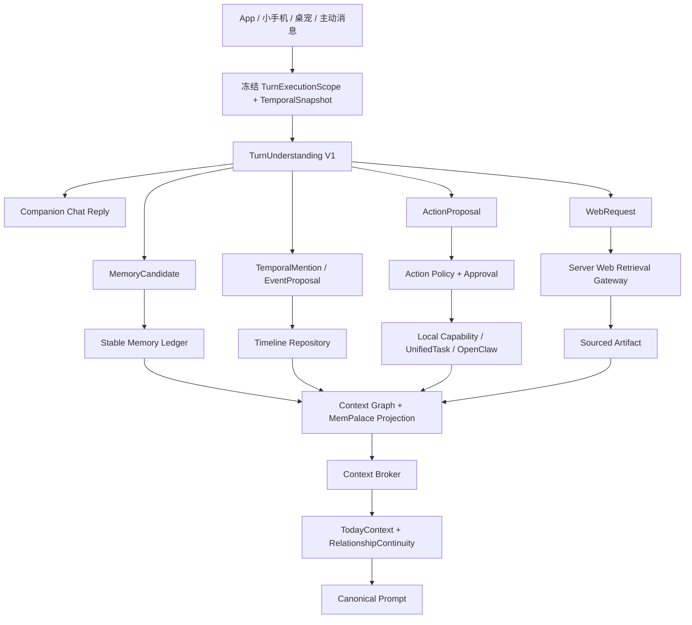

# 月栖时间感知、关系连续性、聊天自动化与记忆统一执行计划

> 版本：v1.0  
> 日期：2026-08-07  
> 执行对象：Cursor  
> 仓库：`F:\beautiful`  
> 上游约束：`docs/CONTEXT_PIPELINE_ENTERPRISE_EXECUTION_PLAN.md`、`docs/NYRA_COMPANION_OS_CURRENT_STATE_AUDIT_AND_EXECUTION.md`  
> 当前任务：收敛现有能力，不重做 UI，不新增第四套记忆系统，不把 OpenClaw 放进普通聊天热路径

---

## 0. Cursor 使用说明

本文档是实施合同，不是概念建议。Cursor 必须按波次执行，每一波完成对应测试和证据后才能继续。

开工前必须：

1. 读取本计划以及上述两份上游文档。
2. 记录 `git status --short` 和当前 HEAD。
3. 当前工作树有大量用户修改，禁止重置、覆盖、批量格式化或回滚无关文件。
4. 先核对本文列出的当前文件和函数仍然存在；若已变化，在实施记录中写清差异。
5. 每一波只改计划列出的职责范围，不借机重写 App、小手机或其他业务页面。
6. 所有“完成”必须有行为测试；禁止只检查源码字符串、文件存在或构建成功。

本计划不要求一次提交完成。推荐每个波次一个独立提交，提交信息包含波次编号。

---

## 1. 产品决定

以下决定已经拍板，Cursor 不得自行改回旧方向。

### 1.1 普通陪伴关系不使用数值

普通 App 聊天、小手机首页和桌宠不得再展示或依赖：

- `intimacy`
- `trust`
- `tension`
- 亲密度百分比
- 好感等级或升级进度条

这些值仅允许保留在明确的情景剧、游戏、模拟体验内部，并且必须使用 `realityNamespace=shared_fiction|simulation` 隔离，不能投影为现实关系事实。

普通关系改用有证据、可解释、可追溯的叙事状态：最近共同经历、当前关心点、未完成约定、用户边界、角色今天的想法。

### 1.2 聊天提及不等于日历写入

- “我明天下午答辩”是时间事实和关心线索。
- “答辩后记得问我”是关系待跟进事项。
- “帮我明天下午三点加答辩提醒”才是日历动作提议。
- 只有明确命令或用户确认后才能写本地日历。
- 外部系统日历、发消息、发帖、购买和删除必须经过更高等级审批。

### 1.3 今日信息是固定 Prompt 契约

每次模型调用都必须得到冻结的、带时区的当前时间，以及经确认的今日事项和待跟进事项。角色不得靠模型常识猜日期，也不得把过期事件说成未来事件。

### 1.4 MemPalace 是检索层，不是另一份事实权威

MemPalace 保留 BM25、向量、KG、抽屉和混合召回能力，但其记录必须可追溯到权威来源。它不得与 Stable Memory、Timeline、Calendar、Diary 各保存一份无法同步的独立事实。

### 1.5 普通聊天不走 OpenClaw

普通情感回复、记忆召回、今日状态和日记生成仍走 Companion Core。只有多步骤工具任务进入 UnifiedTask/OpenClaw。简单确定性动作直接调用受控 Capability。

---

## 2. 当前系统与目标差距

| 能力 | 当前实现 | 目标处理 |
|---|---|---|
| 企业上下文 | Context Broker、Conversation V2、Branch Summary 已接主链 | 保留为唯一 Prompt 组装入口 |
| 今日状态 | `buildDailyBlock()` 只有心情、睡眠、天气、昨日基调 | 替换为完整 TemporalSnapshot + TodayContext |
| 关系状态 | 普通聊天可能修改 intimacy/trust/tension | 从普通聊天移除，改为 RelationshipContinuity |
| 时间线 | `from-conversation.js` 用少量正则直接写事件 | 改为候选、确认、执行三级 |
| 日历 | Calendar Draft/CRUD/审批已存在 | 接入统一 TurnUnderstanding，不再单独猜意图 |
| 任务 | UnifiedTask、Agent Task、OpenClaw 已存在 | 统一由 ActionProposal 路由，不新建任务仓库 |
| 联网 | 天气和模型 API 可联网；通用研究为 `external_pending` | 新增服务端 Web Retrieval Gateway |
| 长期事实 | Candidate Ledger + Stable Memory + Context Graph | 明确 Stable Ledger 为事实权威，Graph 为投影 |
| MemPalace | 混合检索能力强，但也是独立记录容器 | 改造成来源可追溯的统一检索索引 |
| 会话摘要 | 企业 Branch Summary + CP-9 Session Consolidator 并行 | Branch Summary 保留；CP-9 去重/降级为投影任务 |

已确认的具体旧路径：

- `src/prompt/assemble.js::buildDailyBlock`
- `src/prompt/assemble.js` 将 daily block 错放到 `relationship_state`
- `src/companion/relationship-planner.js` 产生数值 delta
- `src/companion/life-state.js` 保存数值关系状态
- `src/phone-shell/phone-shell.js` 将数值合成为亲密度百分比
- `src/timeline/from-conversation.js` 用规则直接写承诺/计划
- `src/agent/capabilities/calendar-draft.js` 已有草稿与审批机制
- `src/contracts/unified-task-v1.js` 已有统一任务合同
- `src/memory/palace/*` 已有混合检索、KG 和抽屉

---

## 3. 最终架构



核心原则：一次理解，多路投影；一个权威，多种检索；所有副作用都有提议、策略、审批、审计和结果写回。

---

## 4. 权威数据源

| 数据 | 唯一权威 | 其他系统职责 |
|---|---|---|
| 聊天原文和分支 | Conversation V2 | IDB messages 仅兼容投影 |
| 旧聊天压缩 | Branch Summary | 只用于当前分支延续，不是永久事实 |
| 用户事实、偏好、边界 | Stable Memory Ledger | Context Graph/MemPalace 建索引 |
| 有时间的现实事件 | Timeline Repository | TodayContext 做读取投影 |
| 日历事项 | Calendar Store | Timeline 保存关联事件和审计引用 |
| 待办和多步任务 | UnifiedTask Repository | Agent/OpenClaw 是执行器 |
| 日记、图片、研究结果 | Artifact/Diary Store | MemPalace 索引正文和来源 |
| 角色设定 | Character Store | Prompt 读取，不复制到记忆 |
| 关系连续性 | RelationshipContinuity Store | 从上述权威源生成，可重建 |
| 混合检索 | MemPalace Index | 不拥有业务事实，可删除重建 |

禁止建立万能表。Conversation、Timeline、Task 和 Artifact 保持不同语义，通过 `sourceType/sourceId/correlationId/evidenceRefs` 关联。

---

## 5. 新数据合同

建议新增 `src/contracts/` 下的合同，并从 `src/contracts/index.js` 导出。

### 5.1 TemporalSnapshot V1

```ts
type TemporalSnapshotV1 = {
  schemaVersion: 1;
  snapshotId: string;
  capturedAt: string;       // ISO instant
  timezone: string;         // IANA, e.g. Asia/Shanghai
  locale: "zh-CN" | "en";
  localDate: string;        // YYYY-MM-DD
  localTime: string;        // HH:mm
  weekday: number;          // 0-6
  utcOffsetMinutes: number;
};
```

规则：一个 Turn 从开始到回复、抽取和写回必须复用同一个 snapshot，禁止中途再次 `new Date()` 改变相对时间基准。

### 5.2 TemporalEvent V1

```ts
type TemporalEventV1 = {
  eventId: string;
  userId: string;
  companionId: string;
  relationshipId: string;
  kind: "observation" | "commitment" | "follow_up" | "calendar" | "task" | "anniversary";
  title: string;
  occurredAt?: string;
  startsAt?: string;
  dueAt?: string;
  endsAt?: string;
  timezone: string;
  temporalText: string;
  status: "proposed" | "confirmed" | "active" | "completed" | "expired" | "cancelled" | "superseded";
  confidence: number;
  sourceType: "conversation" | "calendar" | "task" | "diary" | "system";
  sourceId: string;
  evidenceRefs: string[];
  needsFollowUp: boolean;
  followUpPolicy?: "ask_once" | "notify" | "silent_context";
  createdAt: string;
  updatedAt: string;
};
```

### 5.3 TurnUnderstanding V1

```ts
type TurnUnderstandingV1 = {
  schemaVersion: 1;
  turnId: string;
  scope: FrozenCompanionScope;
  temporalSnapshot: TemporalSnapshotV1;
  conversationalIntent: "chat" | "question" | "control" | "task" | "mixed";
  memoryCandidates: MemoryCandidateProposal[];
  temporalMentions: TemporalMention[];
  eventProposals: TemporalEventV1[];
  actionProposals: ActionProposalV1[];
  relationshipSignals: RelationshipSignal[];
  webRequests: WebRequestProposal[];
  evidenceRefs: string[];
  interpreter: "model" | "deterministic";
};
```

所有 proposal 必须引用用户原文证据。没有连续证据片段的模型输出必须被 validator 丢弃。

### 5.4 ActionProposal V1

```ts
type ActionProposalV1 = {
  proposalId: string;
  capabilityId: string;
  operation: string;
  title: string;
  parameters: Record<string, unknown>;
  risk: "R0" | "R1" | "R2" | "R3";
  explicitness: "explicit_command" | "implicit_suggestion" | "ambiguous";
  exactEffect: string;
  requiresApproval: boolean;
  reversible: boolean;
  evidenceRefs: string[];
  status: "proposed" | "approved" | "rejected" | "executed" | "failed";
};
```

### 5.5 RelationshipContinuity V1

```ts
type RelationshipContinuityV1 = {
  schemaVersion: 1;
  userId: string;
  companionId: string;
  relationshipId: string;
  localDate: string;
  recentSharedMoment?: EvidenceBackedText;
  currentCareFocus?: EvidenceBackedText;
  openLoops: ContinuityLoop[];
  userBoundaries: EvidenceBackedText[];
  characterIntentionToday?: EvidenceBackedText;
  unresolvedMatter?: EvidenceBackedText;
  sourceFingerprint: string;
  generatedAt: string;
};
```

`EvidenceBackedText` 必须包含 `text/sourceIds/evidenceRefs/confidence`。没有来源不得生成“角色发自内心”的事实性陈述。

### 5.6 WebEvidence V1

```ts
type WebEvidenceV1 = {
  evidenceId: string;
  query: string;
  title: string;
  url: string;
  publisher?: string;
  publishedAt?: string;
  fetchedAt: string;
  excerpt: string;
  contentHash: string;
  freshness: "live" | "recent" | "archival" | "unknown";
};
```

---

## 6. 时间引擎

### 6.1 新模块

建议新增：

- `src/temporal/clock.js`：生成冻结快照，允许测试注入 Clock。
- `src/temporal/contract.js`：校验时间合同。
- `src/temporal/resolve.js`：把今天、明天、下周三、晚上等解析为绝对时间区间。
- `src/temporal/event-proposals.js`：从已验证理解结果生成事件候选。
- `src/temporal/today-context.js`：聚合今天、最近、待跟进、过期状态。
- `src/temporal/expiry.js`：事件过期、完成、取消和 supersede 规则。

### 6.2 解析规则

1. 所有相对日期基于 `TemporalSnapshot.timezone`。
2. “明天下午答辩”只有日期和时间段，不得伪造具体 15:00。
3. “明天下午三点”可解析为具体时间。
4. 缺年份的月日选择最近合理未来日期；若跨年存在歧义，保持 proposed。
5. “周末看电影”不得自动成为 commitment，除非出现“约好、一起、记得、提醒”等明确承诺证据。
6. 过去事件默认 `observation`；未来事件默认 `proposed`，明确命令或确认后才 `confirmed`。
7. 相互冲突的时间更新旧事件为 `superseded`，保留审计链。
8. 事件完成、过期后不得继续出现在“今日待办”，但可作为近期共同经历参与关系连续性。

### 6.3 TodayContext

每轮 Prompt 固定生成：

```text
【当前时间】
2026-08-07 14:35，星期五，Asia/Shanghai

【今日已确认事项】
- 15:00 答辩（来源：本地日历）

【需要后续关心】
- 答辩结束后询问结果（来源：用户明确要求）

【最近共同经历】
- 昨晚用户说自己有些紧张
```

约束：

- 只注入与目标 companion 匹配的数据。
- 默认总量不超过 350 tokens。
- 今日确认事项优先于普通长期记忆。
- 过期、取消和未确认候选不得当成已发生事实。
- Prompt Inspector 显示来源、绝对时间、原始证据和裁剪原因。

---

## 7. 统一聊天理解与动作路由

### 7.1 新模块

- `src/turn-understanding/contract.js`
- `src/turn-understanding/interpreter.js`
- `src/turn-understanding/deterministic-fallback.js`
- `src/turn-understanding/validator.js`
- `src/turn-understanding/action-policy.js`
- `src/turn-understanding/dispatcher.js`
- `src/turn-understanding/inspector.js`

### 7.2 执行时序

1. 用户发送消息。
2. 冻结 `TurnExecutionScope` 和 `TemporalSnapshot`。
3. 用户消息写入 Conversation V2。
4. 运行轻量 TurnUnderstanding。
5. 普通回复继续，不等待长任务完成。
6. 将 memory、event、action、web proposal 分发到对应治理入口。
7. 需要确认的动作显示内联卡片，不假装已执行。
8. 执行结果作为 system/task_result 写回同一角色会话和 UnifiedTask。
9. Context Graph 和 MemPalace 只接收完成后的投影。

### 7.3 动作风险策略

| 风险 | 示例 | 策略 |
|---|---|---|
| R0 | 查看天气、查看日历、读取本地资料 | 可直接执行，结果带来源 |
| R1 | 明确命令创建可撤销本地草稿 | 可执行并提供撤销；隐含建议先确认 |
| R2 | 写入本地日历、通知、修改设置 | 展示 exactEffect 后确认 |
| R3 | 删除、外部发布、购买、发送消息 | 永远逐项确认，禁止批量默许 |

显式命令与隐含建议必须区分：

- “帮我加到日历”是 `explicit_command`。
- “我怕明天忘了”是 `implicit_suggestion`，只显示建议卡。
- “明天有答辩”不是动作，只是 temporal observation。

### 7.4 复用现有能力

- 日历：复用 `calendar-draft`、`calendar-crud`。
- 任务：写入 `UnifiedTask Repository`。
- 多步骤工具任务：路由 OpenClaw。
- 简单设置和页面控制：Direct Action/Capability，不进入 OpenClaw。
- 主动消息：复用 Proactive Pipeline，但输入改为 confirmed event/open loop。
- 所有结果写回：复用 `writeCompanionTurn` 和 OpenClaw writeback 语义。

不得新建 `relationship-task-store`、`chat-calendar-store` 或第二个任务中心。

---

## 8. 非数值关系连续性

### 8.1 移除普通聊天数值依赖

普通现实聊天中：

- `onCompanionChatTurn()` 不再应用 intimacy/trust/tension delta。
- `life-state.js` 不再用数值决定角色普通回复或桌宠文案。
- 小手机首页删除亲密度数字和进度条。
- `prompt/assemble.js` 不注入数值。
- 旧数据保留只读迁移一版，不做破坏性删除。

情景剧目录下的 tension/intimacy/trust 保留，但输出必须属于 `shared_fiction` 或 `simulation`。

### 8.2 RelationshipContinuity 生成

触发条件：

- 本地日期变化；
- 新的 confirmed event；
- 新的稳定记忆或边界纠正；
- 任务完成；
- 日记完成；
- 未完成 open loop 状态变化。

生成方式：

1. 先由确定性 projector 选择证据。
2. 可选模型只负责把证据改写成角色口吻。
3. 模型不得新增时间、事件、情绪原因或承诺。
4. 改写结果必须经过 claim-to-evidence 校验。
5. 模型失败时使用确定性短句，不阻塞启动。
6. 以 `sourceFingerprint` 去重；同一天且来源不变不重复付费生成。

### 8.3 UI 输出

小手机首页替换原亲密度卡：

```text
早上好，月栖
昨天你终于把答辩材料改完了。
今天我想陪你轻松一点。
```

要求：

- 最多 2–3 行，不展示调试字段和数值。
- 点击可打开“为什么她这样说”来源页。
- 用户可以纠正、忘记或关闭某类主动关心。
- App 版和小手机读取同一 RelationshipContinuity，不分别生成。

---

## 9. 记忆与 MemPalace 统一

### 9.1 写入主链

```text
Conversation V2 turn
  -> TurnUnderstanding
  -> Candidate Ledger
  -> controlled promotion
  -> Stable Memory
  -> Context Graph projection
  -> MemPalace index projection
```

明确用户陈述可按现有规则稳定化；模型推断保持 pending。冲突事实不得两个都以“稳定真相”注入，应标记 suspected/superseded 并优先最近用户纠正。

### 9.2 MemPalace 索引合同

每条索引至少保存：

```ts
{
  indexId: string;
  sourceType: "stable_memory" | "timeline_event" | "diary" | "artifact" | "branch_summary";
  sourceId: string;
  companionId: string;
  relationshipId?: string;
  realityNamespace: string;
  contentHash: string;
  projectionVersion: number;
  indexedAt: string;
  searchableText: string;
  embedding?: number[];
}
```

索引命中后必须回源读取权威记录。源记录已删除、过期、取消、改变角色或 contentHash 不一致时，命中作废并排队重建。

### 9.3 统一召回排序

建议综合：

- lexical/BM25 相关度
- embedding 相关度
- KG/实体邻接
- 时间相关度
- 用户显式重要性
- 证据置信度
- 当前 purpose policy

不要只按相似度。推荐初始权重用于实现和测试，后续可调：

```text
semantic 0.30
lexical 0.25
temporal 0.20
salience 0.15
evidence 0.10
```

硬优先级高于评分：今日确认事项、用户边界、未完成承诺、最近纠正不能被普通语义记忆挤掉。

### 9.4 各层职责

- Branch Summary：只压缩较早聊天，不自动晋升永久事实。
- Stable Memory：长期事实和关系理解。
- Timeline：有时间、状态和生命周期的事件。
- Diary：完整叙事文档，必要时产生独立候选，不能整篇塞 Prompt。
- CP-9 Consolidator：停止生成第二套会话事实；只允许作为低优先级重建/修复任务，最终应移除重复存储。
- Context Graph：保留企业检索和治理字段，但写入来源必须指向 Stable/Timeline/Artifact。

### 9.5 自动完善任务

新增低优先级后台维护任务，禁止阻塞聊天：

1. 同义候选去重。
2. 用户纠正后的 supersede。
3. 事件过期和完成投影。
4. MemPalace stale index 清理。
5. 缺失 embedding 的增量补齐。
6. 同一 source 的重复 Context Graph 投影合并。
7. 被删除/忘记数据的级联 tombstone。

维护任务不得自行把推断候选升级成稳定记忆。

---

## 10. Prompt 与 Context Broker 改造

### 10.1 Canonical blocks

将现有误用的 `relationship_state=dailyStatus` 拆成两个正式块：

- `temporal_context`
- `relationship_continuity`

建议顺序：

```text
platform_safety
character_package
user_persona
temporal_context
relationship_continuity
mode_context
world_info
long_term_memory
branch_summary
history messages
world_info_after
post_history_contract
current user input
```

### 10.2 预算

Balanced 8k 档建议：

- temporal_context：最多 350 tokens
- relationship_continuity：最多 220 tokens
- stable boundaries/open loops：硬保留，最多 250 tokens
- MemPalace 普通召回：最多 600 tokens
- Branch Summary：最多 500 tokens
- 近期原文仍占主要 History 预算

不得为了“角色更懂时间”把完整日历、完整 Timeline 或整篇日记塞进 Prompt。

### 10.3 Purpose policy

- chat：今日事项、稳定事实、共同经历、开放约定。
- deskpet：极短今日摘要和一项最高优先 open loop。
- proactive：只允许 confirmed + proactiveAllowed 数据。
- diary：允许当天聊天、相关共同经历、旧日记摘要，不允许任务执行日志。
- scenario：明确 namespace，不污染 reality。
- task/openclaw：只给任务所需上下文，不复制完整恋爱历史。

### 10.4 Inspector

Context Inspector 新增：

- TemporalSnapshot
- 相对时间解析结果
- proposal -> authority write 路径
- TodayContext 每一行来源
- RelationshipContinuity 每一行证据
- MemPalace 命中源记录和失效原因
- action risk、审批和执行结果

---

## 11. 联网检索

### 11.1 当前边界

客户端当前只有天气、模型 API 等有限联网；`local-research` 明确把真实 Web Search 标记为 `external_pending`。不得在 UI 里假装已经联网。

### 11.2 服务端 Gateway

在现有 `server/index.mjs` 上增加模块化路由，建议拆出：

- `server/retrieval/search.mjs`
- `server/retrieval/fetch.mjs`
- `server/retrieval/normalize.mjs`
- `server/retrieval/cache.mjs`
- `server/retrieval/security.mjs`

接口建议：

```text
POST /api/retrieval/search
POST /api/retrieval/fetch
```

客户端新增：

- `src/integrations/web-retrieval/client.js`
- `src/integrations/web-retrieval/schema.js`
- `src/integrations/web-retrieval/artifact.js`

### 11.3 安全和产品规则

1. API Key 只在服务器。
2. URL fetch 必须防 SSRF，拒绝 localhost、私网、file 协议和重定向到私网。
3. 限制响应体、超时、MIME、重定向次数和并发。
4. 每条结论必须携带来源。
5. 时效性问题优先最新来源并显示发布时间。
6. 联网资料默认只存在当前回复或研究 Artifact，不自动变成用户事实。
7. 用户明确“保存这份资料”后才持久化。
8. 角色必须区分“我从网上查到”和“我记得你说过”。

---

## 12. 分波次实现

### W0：基线与特性开关

目标：不改变行为，建立可回退基线。

工作：

- 保存当前相关测试输出。
- 为新链路增加 feature flags：`temporalContextV1`、`turnUnderstandingV1`、`relationshipContinuityV1`、`palaceProjectionV1`、`webRetrievalV1`。
- 增加可注入 Clock 和 deterministic IDs。
- 记录旧 relationship 数值数据迁移策略。

验收：现有 memory/context/openclaw/calendar 测试无回归。

### W1：停止普通聊天数值关系

目标：先止血，不立即删除情景内部数值。

修改：

- `src/companion/session-hooks.js`
- `src/companion/relationship-planner.js`
- `src/companion/life-state.js`
- `src/companion/life-tick.js`
- `src/companion/pet-presence-bridge.js`
- `src/phone-shell/phone-shell.js`
- 相关 i18n 和 CSS

要求：普通聊天不再产生数值 delta；小手机不再渲染亲密度数字/进度条；scenario/experience 测试继续通过。

### W2：时间合同和 TodayContext

目标：任何模型调用都知道绝对时间和事件状态。

工作：新增 temporal 模块；扩展 ContextRequest/Envelope；Timeline 迁移字段；实现 TodayContext；接 Prompt Inspector。

验收：跨午夜、跨时区、明天/后天/下周、过期/取消/改期、DST 测试通过。

### W3：TurnUnderstanding 和 proposal 治理

目标：替换各模块单独正则直写。

工作：实现统一合同、模型解释器、确定性 fallback、证据 validator、proposal dispatcher；先 shadow mode 运行，只记录不执行，并对比旧规则。

验收：同一句消息只产生一次 proposal；无证据 proposal 被拒绝；普通聊天延迟不因长任务明显增加。

### W4：日历、待办、任务与控制闭环

目标：聊天能安全控制现有功能。

工作：ActionProposal 接 calendar draft/crud、UnifiedTask、Direct Action、OpenClaw；实现内联确认卡、拒绝、撤销、执行结果写回。

验收：观察句不写日历；明确命令展示准确预览；确认后写入；拒绝无副作用；重复点击幂等。

### W5：记忆权威和 MemPalace 投影

目标：消除三套长期事实互相竞争。

工作：明确 Stable/Timeline/Artifact 写入；Context Graph 和 MemPalace 改投影；实现回源校验、stale 清理、重建命令；降级 CP-9 重复写入。

验收：删除/忘记/改角色后无法通过 Palace 召回旧内容；索引可完全删除并从权威源重建；多角色隔离通过。

### W6：RelationshipContinuity 和首页角色表达

目标：用有证据的角色语言替代数值。

工作：projector、可选模型改写、来源页、用户纠正；App 和小手机共享同一 continuity；日记/任务完成后刷新。

验收：无证据不生成事实；同日无变化不重复生成；角色切换不串内容；首页无数值好感组件。

### W7：联网检索

目标：真实联网、带来源、服务端安全。

工作：Gateway、客户端、WebEvidence、Artifact 保存、当前信息意图路由、缓存和限流。

验收：无来源不完成；断网诚实失败；SSRF 测试通过；API Key 不进客户端包；实时信息显示时间。

### W8：旧链清理与正式切换

目标：关闭 shadow mode，删除重复直写。

工作：删除 `from-conversation.js` 粗糙直写入口或改成 fallback proposal producer；移除普通关系数值读取；移除 CP-9 权威写入；补迁移和回滚工具；更新文档。

验收：全仓搜索确认没有普通聊天直接写 relationship 数值、没有未审批日历写、没有无来源 Web complete、没有双记忆权威。

---

## 13. 文件级实现路径

### 新增

- `src/contracts/temporal-snapshot-v1.js`
- `src/contracts/temporal-event-v1.js`
- `src/contracts/turn-understanding-v1.js`
- `src/contracts/action-proposal-v1.js`
- `src/contracts/relationship-continuity-v1.js`
- `src/contracts/web-evidence-v1.js`
- `src/temporal/*`
- `src/turn-understanding/*`
- `src/relationship/continuity-store.js`
- `src/relationship/continuity-projector.js`
- `src/relationship/continuity-rewrite.js`
- `src/memory/projection/*`
- `src/integrations/web-retrieval/*`
- `server/retrieval/*`

### 重点修改

- `src/panels/chat.js`：冻结 snapshot、调用 interpreter、分发 proposals。
- `src/prompt/assemble.js`：新增 temporal/continuity canonical blocks，修正 daily block 误用。
- `src/context/contract.js`：ContextRequest/Envelope 增加 temporal 字段。
- `src/context/broker.js`：TodayContext、Continuity、Palace source hydration。
- `src/context/purpose-policy.js`：各 surface 时间/关系/联网权限。
- `src/context/inspector.js`：新 trace。
- `src/timeline/repository.js`：TemporalEvent 生命周期和 migration。
- `src/context/timeline-projector.js`：只投影 confirmed/active。
- `src/timeline/from-conversation.js`：改为 proposal fallback，最终不直接写。
- `src/memory/candidate-ledger.js`：保留稳定事实权威和 evidence gate。
- `src/context/pipeline.js`：Context Graph 改来源投影语义。
- `src/memory/palace/drawer.js`、`search.js`、`hybrid.js`、`kg.js`：索引合同和回源。
- `src/agent-orchestrator/index.js`：消费 ActionProposal，而非再次解释整句。
- `src/calendar/calendar-task-dispatch.js`：接 proposalId/correlationId/snapshot。
- `src/agent/capabilities/calendar-draft.js`、`calendar-crud.js`：幂等、精确 effect、显式性策略。
- `src/tasks/unified-task-repo.js`：关联 proposal/turn/companion。
- `src/proactive/pipeline.js`、`scheduler.js`：只消费 confirmed open loops。
- `src/integrations/openclaw-mobile/writeback.js`：任务结果关联 Timeline/Continuity，禁止直接稳定化用户事实。
- `src/diary/records.js`：日记完成刷新 continuity；日记事实仍走候选治理。
- `src/phone-shell/phone-shell.js`：移除亲密度 UI，渲染 continuity。
- `src/app.js`：App/小手机共享服务和 deep link，不各自生成关系文案。

---

## 14. 测试计划

新增脚本建议：

- `verify:temporal-contract`
- `verify:temporal-resolution`
- `verify:today-context`
- `verify:turn-understanding`
- `verify:action-policy`
- `verify:chat-calendar-loop`
- `verify:relationship-continuity`
- `verify:palace-projection`
- `verify:web-retrieval`
- `verify:companion-intelligence-v1`

### 14.1 必测语句

| 输入 | 预期 |
|---|---|
| 我明天下午答辩 | observation；不写日历 |
| 答辩后记得问我 | confirmed follow_up；不写日历 |
| 帮我明天下午三点加答辩提醒 | R2 action proposal；确认后写日历 |
| 周末可能想看电影 | proposed mention；不是共同约定 |
| 我们周六晚上一起看电影，记住 | confirmed shared plan |
| 不要再叫我宝宝 | 稳定边界纠正；旧称呼 superseded |
| 查一下明天上海天气 | R0 Web/weather；结果带时间和来源 |
| 帮我发消息告诉他我会迟到 | R3 外部发送 proposal；不得自动发送 |

### 14.2 时间测试

- 23:59 到 00:01 的 today 切换。
- 用户时区和服务器时区不同。
- DST 前后不存在/重复时间。
- 二月、闰年、跨年“下周一”。
- 改期、取消、完成和过期。
- 相对时间解析使用冻结 snapshot。

### 14.3 隔离测试

- 角色 A 的事件、连续性和 Palace 索引不被角色 B 召回。
- 群聊不写入任一角色 DM 的私人记忆。
- shared_fiction 不投影到 reality。
- OpenClaw 任务结果只回写发起角色。
- 删除/忘记后所有投影失效。

### 14.4 UI/E2E

- App 和小手机同一条聊天只创建一个 proposal。
- 确认卡可触控、拒绝、撤销、重复点击不重复执行。
- 小手机首页不显示亲密度数字。
- Continuity 文案不溢出、可查看来源、可纠正。
- 离线时聊天仍可用，联网请求诚实失败。
- Android 真机验证日历写入、通知、后台恢复和时区切换。

### 14.5 回归命令

每波至少运行相关子集，W8 必须运行：

```powershell
npm run verify:context-enterprise
npm run verify:memory-pipeline
npm run verify:multi-companion
npm run verify:companion-cp9
npm run verify:task-center-unify
npm run verify:openclaw-mobile-slice
npm run build
```

再运行新建的 `verify:companion-intelligence-v1` 总套件和真实浏览器/Android E2E。

---

## 15. 迁移与回滚

### 15.1 数值关系数据

- 旧 intimacy/trust/tension 不删除。
- 标记为 `legacyScenarioMetrics` 或保留旧 key 只读。
- 普通聊天不再更新或读取。
- 情景剧读取时必须声明 namespace。

### 15.2 Timeline

- 旧事件迁移为 `sourceType=legacy_timeline`。
- 无绝对时间的旧事件保持 observation，不猜 dueAt。
- 旧正则产生的 shared_plan 默认降为 proposed，除非有明确证据。

### 15.3 MemPalace

- 首次启动构建 source census。
- 无 sourceId 的 legacy 记录进入 quarantine，不自动注入。
- 提供只读报告、重建、回滚和清理命令。
- 切换期间可双读比较，但只允许权威源单写。

### 15.4 Feature flag 回滚

任一新链路失败时：

- 聊天仍使用 Conversation V2 + Context Broker + Branch Summary。
- 禁止回退到旧关系数值和正则直接写事件。
- 可关闭 TurnUnderstanding 副作用，仅保留普通回复。
- 可关闭 Web Gateway，不得返回伪联网结果。

---

## 16. 性能与成本要求

- TemporalSnapshot 和 TodayContext 本地生成，目标 < 10 ms。
- TurnUnderstanding 不得串行阻塞首 token；优先并行或在用户消息写入后异步运行。
- 明确控制命令需要 proposal 时，可先快速确定性解析，再由模型补充。
- RelationshipContinuity 同日同 fingerprint 只生成一次。
- MemPalace 增量索引，不得每次启动全量 embedding。
- Web Retrieval 有缓存、超时和取消；失败不阻塞普通聊天。
- OpenClaw 继续懒加载，不进入普通聊天首屏和热路径。

---

## 17. 完成定义

只有以下全部成立，才能称本计划完成：

1. 普通聊天和小手机首页无亲密度、信任、张力数值。
2. 角色每轮收到冻结时间、时区、今日确认事项和待跟进事项。
3. 过去、现在、未来、过期和取消事件不会混淆。
4. 聊天提及不会擅自写日历。
5. 明确命令可生成精确 proposal，确认后真实执行并可审计。
6. 日历、待办、设置控制和多步骤任务复用同一 ActionProposal 主链。
7. 普通聊天不加载 OpenClaw。
8. RelationshipContinuity 每句话都有来源，可纠正、可忘记、可重建。
9. Stable Memory、Timeline、Calendar、Task、Artifact 各有唯一权威。
10. MemPalace 删除后可从权威源完全重建，且不会召回已删除源。
11. 通用联网是真实服务端检索，所有结论带来源，断网不伪造完成。
12. App、小手机、桌宠和主动消息对同一角色读取一致结果。
13. 多角色、群聊、虚构世界和现实世界隔离测试全部通过。
14. 浏览器 E2E 和 Android 真机路径通过，不以 Node 测试代替产品验收。

---

## 18. 禁止事项

- 禁止再新建一套聊天历史。
- 禁止再新建一套任务仓库。
- 禁止把 MemPalace 当权威事实数据库继续双写。
- 禁止用更多正则直接修改日历、任务或关系状态。
- 禁止模型无证据生成“我们昨天做过什么”。
- 禁止把联网资料混成用户记忆。
- 禁止普通聊天每轮运行 OpenClaw。
- 禁止把情景剧数值带入现实关系。
- 禁止只改小手机首页文案而不修数据链。
- 禁止为了过测试写固定 fixture 或假联网结果。

---

## 19. Cursor 每波交付格式

每完成一波必须提交：

1. 修改文件列表。
2. 权威写入者是否变化。
3. 新旧链路差异。
4. 迁移和回滚方式。
5. 执行的测试命令和真实结果。
6. 未完成项和已知风险。
7. 浏览器或真机证据路径。

未提供以上内容，不接受“已经完成”的结论。
